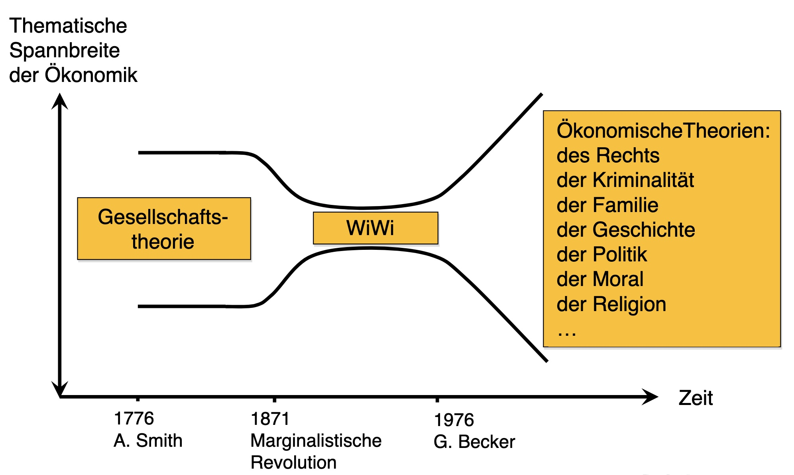

# 11.10.2022 Argumentation

## Wirtschaftsethik als Wissenschaft

Regeln des wissenschaftlichen Prozesses

```
Positiv I: Stimmen die Fakten?
Positik II: stimmen die theoretischen Kausalzusammenhänge?
Normativ: Sind etwaige Wertungen allgemein zustimmungsfähig?
```

orthogonale Positionierung von Ingo Pies:


## Der praktische Syllologismus

```
1. Normative Prämisse             Wollen
2. positive Prämisse              Können
----------------------------------------
3. Normative Conclusio            Sollen
========================================
```


## Wirtschaftsethik

= interdisziplinärer Ansatz (Soziologie, Politik, Ökonomik, Ethik)

> Selfishness beats altruism within groups. Altruistic groups beat selfish groups. Everything else is commentary.
>
> ~ David Wilson, Edward Wilson

Evolutionspsychologie: Kleine Kiner folgen moralischen Impulsen, noch bevor sie zu sprechen gelernt haben

Insbesondere Marktwirtschaft bringt schnelle moralische Urteile, obwohl sie wesentlich komplexer ist

### Ökonomik

Entwicklung der ökonomischen Wissenschaft:



die neoklassiche Ökonomik analysiert den *homo oeconomicus* und seine Handlungen:

```mermaid
graph LR
Ziele & Mittel --> Handlungen
Handlungen --> Handlungsfolgen
Handlungsfolgen --> intendiert & a[nicht intendiert]
```

- **Moralistischer Fehlschluss**: Handlungsfolgen durch Zieländerungen 
- **Intentionistischer Fehlschluss:** Ziele sollen Handlungsfolgen erklären

### Wirtschaftsethik

suche intelligenten Mittelweg


