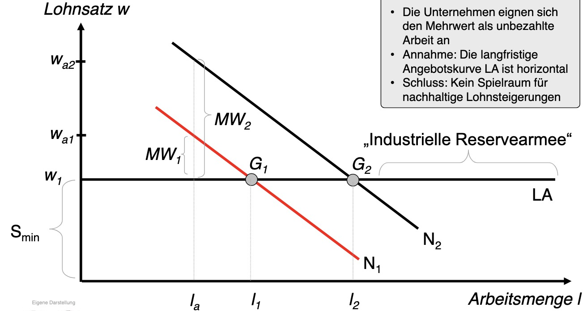
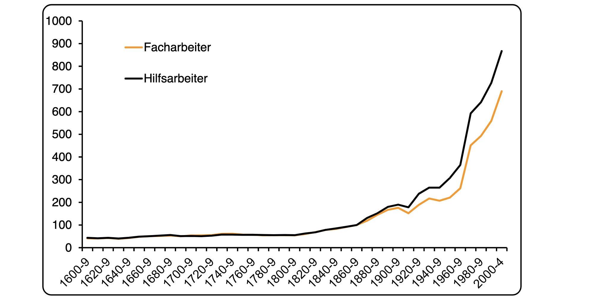

# 13.12.2022 Marxismus

## Grundidee

Analogieschluss: Gütermarkt auf Arbeitsmarkt

- **Gütermarkt:** Preis basiert auf Produktionskosten
- **Arbeitsmarkt:** Preis basiert auf *Reproduktion*skosten

Problem: *does not quite work out ...*

Die Menge an Arbeitskraft ist nicht begrenzt! (im Gegensatz zu Mobilität des Kapitals)

Mehrwertanalyse = heutige Konsumentenrente

Marxismus

- Mehrwert der Arbeit = geht vollständig an Kapitalisten
- Bevölkerungswachstum = Lohnkonkurrenz
- Lohnniveau auf Subsistenzlohn
- steigende Bevölkerungszahl

Problem:

- technischer Fortschritt
- Ausweitung Arbeitsnachfrage
- Erschöpfung der Industriellen Reserverarmee
- Steigerung Löhne

Ergebnis (der Neoklassik): Verbraucher und Konsumenten profitieren

> „Das erfolgversprechendste Mittel zur Erreichung und Sicherung des Wohlstands ist der Wettbewerb. Er allein führt dazu, den wirtschaftlichen Fortschritt allen Menschen, im besonderen in ihrer Funktion als Verbraucher, zugute kommen zu lassen, und alle Vorteile, die nicht unmittelbar aus höherer Leistung resultieren, zur Auflösung zu bringen.
>
> ~ Ludwig Erhard

## Mindestlohn

> Oh ne, nciht schon Wieder, wer Forschung (echte Makroökonomik) zu den Folgen will (nicht den Pieschen Mikrozeug), siehe hier: [Makroökonomische Folgen des Mindestlohnes](https://www.ecosia.org/search?q=mindestlohn%20aktuelle%20makro%C3%B6konoimsche%20paper&addon=firefox&addonversion=4.1.0&method=topbar)

Empirische Erfolge des Mindestlohns:

- keine nennenswerte Steigerung der Arbeitslosenquote
- Senkung der Ungleichheit
- Steigerung der Reallöhne am unteren Spektrum
- Stärkung der Wirtschaftstruktur
- Innovationszuwachs

