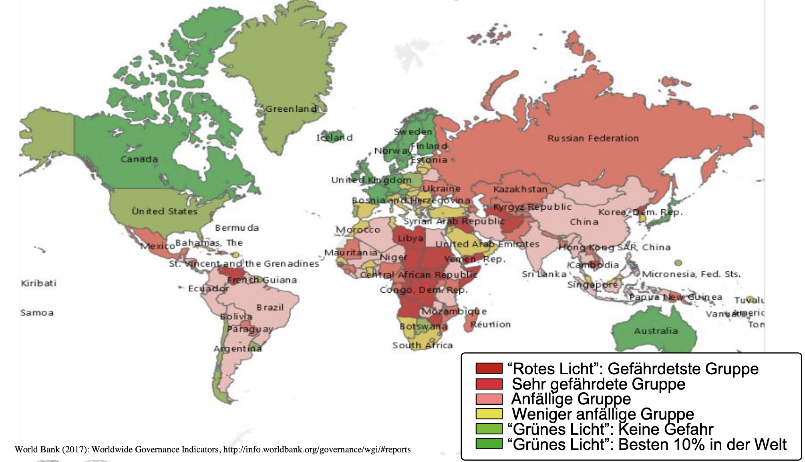
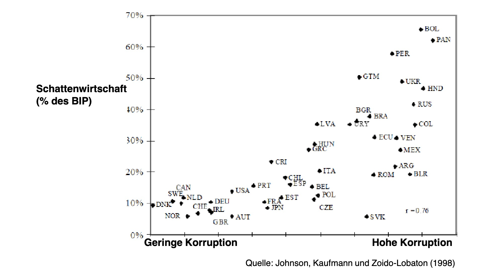
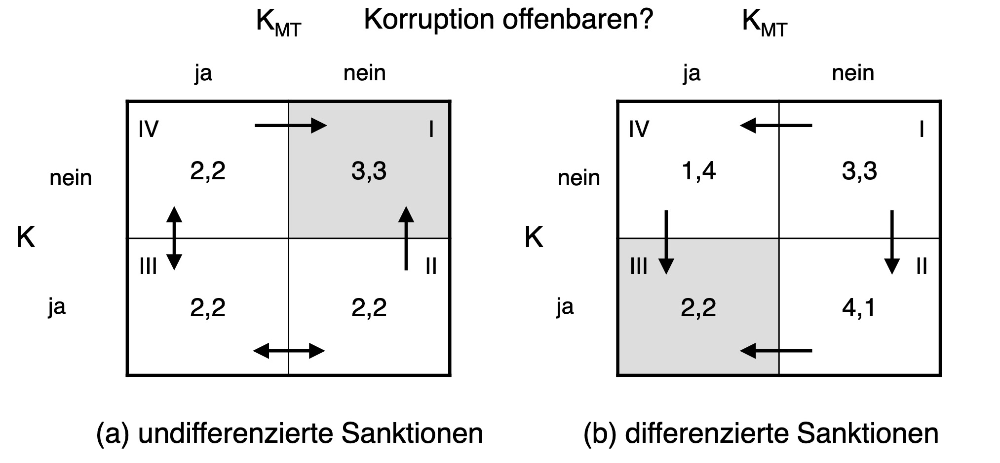

# 17.01.2023 Korruption

## Ausmaß

State of Corruption World-Bank



Korruption korreliert mit:

- Verletzung von bürgerlichen Freiheiten
- Bevölkerung, die auch bezahlt
- Morden an Menschenrechtsaktivisten


## Auswirkungen

Doppelte Wirkung:

1. Verteuerung von Produkten um Bestechungssumme
2. Schäden an Vertrauen und Hintergehen von Genehmigungen
    - bspw. Gebäude, die nicht sicher sind und einstürzen
    - Sozialschädlich! strukturelle Auswirkung


### Verhaltensänderung von Unternehmen

Erwartung von Korruption = niedrigere Investitionen

- saubere Länder: viele Investitionen, wenige Kredite
- unsaubere Länder: viele Kredite, wenig Direktinvestitionen
    - => höhere Instabilität


Steigerung des Schwarzmarktsektors => Schattenmarkt Anteil am BIP



### Verhaltensänderung öffentlicher Akteure

verzerrte Einsetzung von Geldern: 

- große Projekte = viel Geldabzweigung
- kleine Projekte = schwieriger

=> *"White-Elephant Projects"*


Schaffen unsinniger Regeln

- mehr Möglichkeiten für Schmiergeld bei nervigen Anträgen
- Schaffung von Zutrittsbarrieren / Monopole


## Mechanismus

```mermaid
graph TD
subgraph Unternehmen
Angestellter --schadet--> Arbeitgeber
end
subgraph Lieferant
Klient  
end
Klient --Bestechung--> Angestellter
Angestellter --Auftrag--> Klient
```

Korruption = Tauschakt zwischen Angestellter und Klient

- Klient will für Lieferant Auftrag und besticht mithilfe von **schwarzen Kassen**
- aber nicht wohlfahrtserhöhend
- schadet Drittem (Arbeitgeber)

`Bruch eines gesellschaftlich schützenswertem Vertrages`


## Bekämpfung

in DE oft mithilfe von Strafrecht

- stellt Klient und Angestellten unter Strafe
    - aktiv Bestechen
    - und Bestechenlassen 

Aber: Korruption = verborgene Tat (*"victimless crime"*)


- Arbeitgeber erkennt Tat nicht
- ohne Kläger keine Strafe


## Prävention

- Prävention im bestochenen Unternehmen teuer
- aber im bestechenden Unternehmen einfacher
    - schwarze Kassen angreifen
    - Klient wird toleriert von eigentümer des Lieferanten


auch bestechende Unternehmen haben Interesse an Prävention

- weil Konkurrenz um Auftrag => steigende Gelder etc.
- im Korruptionssumpf: alle bestechen, keiner glücklich


außerdem:

- nicht nur Mittäter, auch Mitwisser im Unternehmen
- diese tolerieren den Akt

=> wie kann man diese Kooperation stören? **Kronzeugenregelungen**



**Kronzeugenregelung:** Differenzierte Sanktionen des Strafrechts stören Nash-Gleichgewicht


**Whistleblower**: anonymes Hinweissystem

- soziale Kosten *c* einer Anzeige verringern


## Text

```
Autor: Ingo Pies
Titel: Jorruptionsprävention - wie aktiviert man die Selbstheilungskräfte des Marktes
Datum: 2008
```

Fragen

1. **Warum erschließt sich die Sozialschädlichkeit von Korruption nicht immer auf den ersten Blick?**
    - Entlastungskorruption kann vorteilhaft wirken
    - Beziehung zwischen Agent und Klient (Beamter und Privatmensch)
    - Prinzipal hat Informationsbarriere zu Agent (Steuerzahler - Beamter)
2. **Inwiefern ist Korruption ein Geheimhaltungsdelikt?**
    - basiert auf Informationsbarriere zwischen Agent udn Prinzipal (Beamter und Stuerzahler)
    - erkannt nur durch aufwendige Kontrollen
3. **Was versteht man unter der „fundamentalen Asymmetrie“?**
    - Eigentümer können Klient kontrollieren
        - die Gelder kommen meist aus schwarzen Kassen in Unternehmen, nicht Privaten
    - Prinzipal aber schlecht Agenten
    - deswegen Asymmetrie
4. **Was bedeutet „Ordnungspolitik zweiter Ordnung“?**
    - nimmt Asymmetrie in Blick
    - geht auf Eigentümer der zahlenden Unternehmer
    - Organisationsstrafrecht > Individualstrafrecht
    - bspw. mit Kronzeugenregelung, Whistleblower, Verhaltenskodex


Arten der Korruption:

- Belastungsk. :
    - Sonderleistungen abnötigen (Entwicklungsländer)
    - Bestechungsgelder bei Verkehrskontrolle,…
- Entlastungsk. :
    - zu Lasten Dritter, wie Tausch
    - Zahlung für Steuererleichterung
    - kann vorteilhaft wirken, deswegen nicht immer als schädich erkannt
    - auch Privatwirtschaft!
