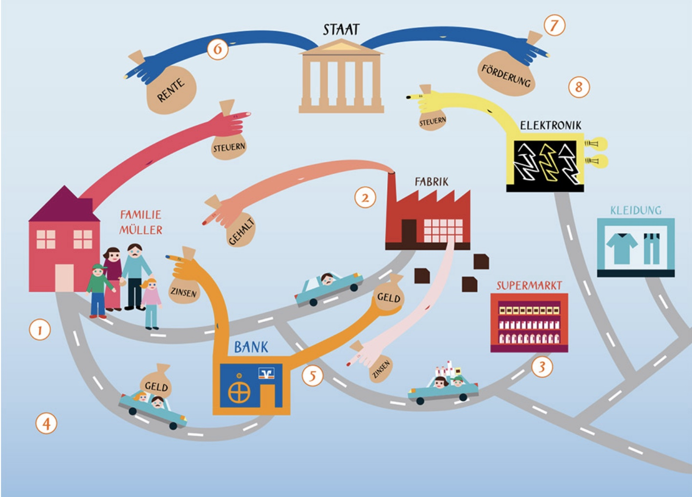

# 13.10.2022 Makroökonomik I

Professor: [Oliver Holtemöller](https://twitter.com/holtemoeller)

Zeit: Donnerstag 14:15-15:45

## Was ist Makroökonomik

> Makroökonomik ist die Lehre von Struktur und der Entwicklung gesamter Volkswirtschaften und von den **wirtschaftspolitischen** Einflussmöglichkeiten auf die **gesamtwirtschaftliche** Entwicklung

Bestandteile der Makroökonomik: ihre Flüsse

- Haushalte
- Unternehmen
- Staat

## Schritte in der Makro

1. Dokumentiere die **Fakten**
2. Entwickle ein **Modell**
3. Vergleiche **Vorhersagen** des Modells
4. Benutze das Modell zum Verständnis **Wirkungszusammenhänge**

## Volkswirtschaftliche Gesamtrechnungen

> **VGR:** ein umfassendes, übersichtliches, quantitatives Gesamtbild des wirtschaftlichen Geschehens

- insbesondere Bruttoinlandsproduktsberechnung (BIP)
    - Entstehensrechnung
    - Verwendungsrechnung

> **BIP:** Wert der im Inland hergestellten Waren + Dienstleistungen (abzüglich Vorleistungen)

- laufende Preise (**nominal**) oder preisbereinigt (**real**)

