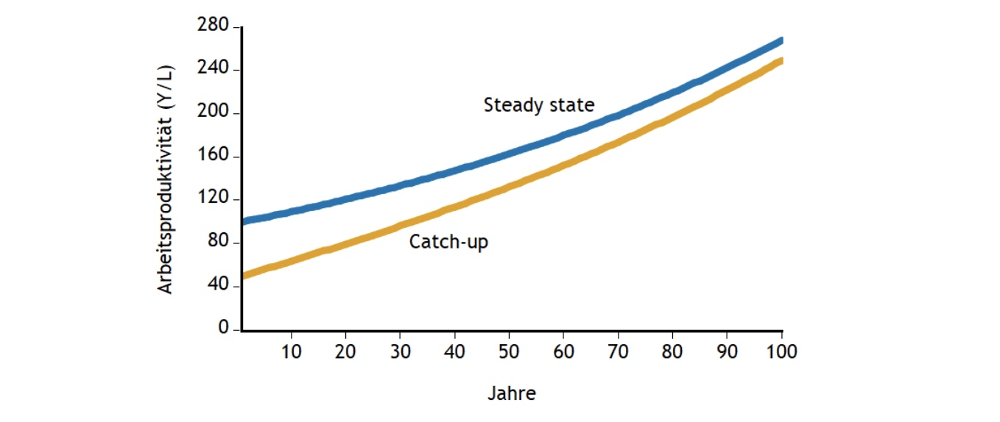
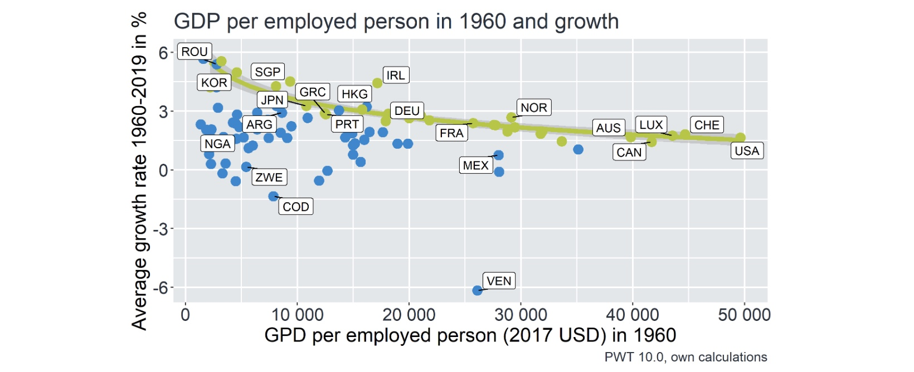
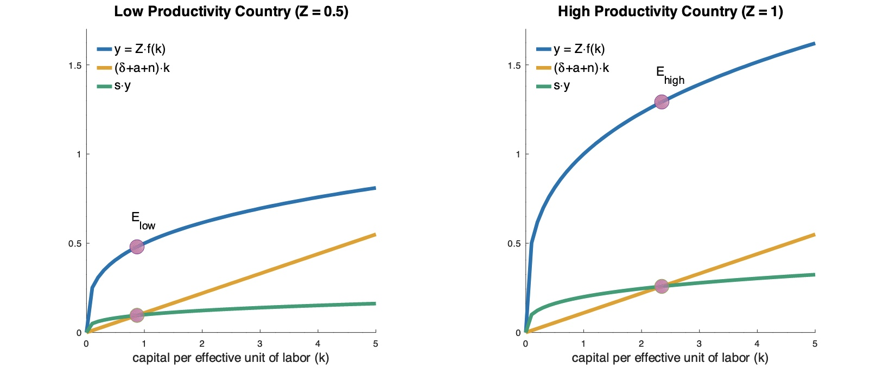
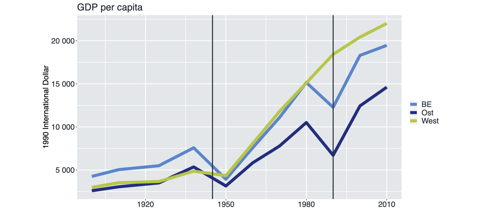
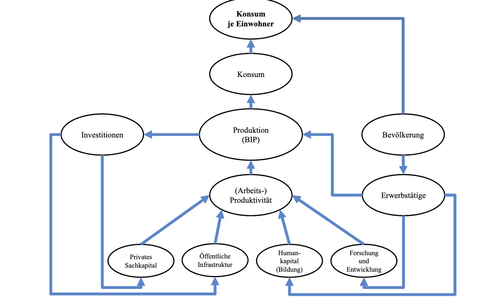
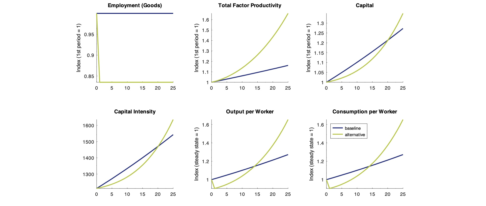

# 17.11.2022 Erklärungen für langfristiges Wirtschaftswachstum

## Catch-Up Wachstum

auholdendes Wachstum durch Bewegen auf Steady-State

- Konvergenz der Arbetisproduktivität
- je weiter vom Steady State entfernt => schnelleres Wachstum
- Empirisch: **2%** Lücke schließen pro Jahr (bei gleichen Bedingungen)
    - bsps. Nord/Süd USA, Ost/Westdeutschland, Süd/Norditalilien

### Wachstumsclubs

Annahme: es gibt 2 Arten von Ländern, eine folgt Solow (grün) andere nicht (blau)

- Wachstum für ärmere Länder höher?

## Bedingte Konvergenz

Annahme: die Effizienz Z  der Anwendung von Technologie ist unterschiedlich

Erklärungen für Z:

- Geographie
- Kultur (aka Arbeitsethos)
- **Institutionen**

## Institutionen

beispielsweise Wirtschaftssystem/ Rechtssicherheit ...

Beispiel Ost / West:

- Soziale Normen
    - Eigentumsrechte
    - Menschenrechte
- Humankapital
    - Bildung
    - Gesundheit
- Forschung / Entwicklung
- Öffentliche Infrastruktur
    - Verkehr
    - Kommuniaktion
    - Energie

## Endogenes Wachstum nach Romer

Solow Modell frage: Wie entsteht technologischer Fortschritt im System (endogen)?

Romers Antwort:

- Aufteilung **Güterproduktion** und **Ideenproduktion** (Forschung)
    - dann Forscher $L_A$ und Arbeiter $L_Y$
- Anteil der Forscher an Bevölkerung $\gamma_A$ 
    - sie können dann aber kein Anteil an Wachstum an sich haben
- Produktivität der Ideenproduktion = *u*

dann Wirtschaftswachstum:
$$
\hat{y}_t = \frac{1}{1-\alpha} \frac{\gamma_A}{\mu} L
$$
Effekt einer Erhöhung des Anteils der Forscher

Implikationen:

- individuelle Investitionen in F&E haben positiven externen Effekt
    - wird aber nicht in Berechnung einbezogen
- Effekte wirken erst sehr langfristig 
- kurzfristige Politik ist whack

## Humankapital nach Lucas

Ein Anteil der Bevölkerung ist Lehrende und kann nicht schuften
$$
Y = K^a H^b (AL)^{1-a-b}
$$
Humankapital wir ´d angeschafft und entwertet (ähnlich zu echtem Kapital)

