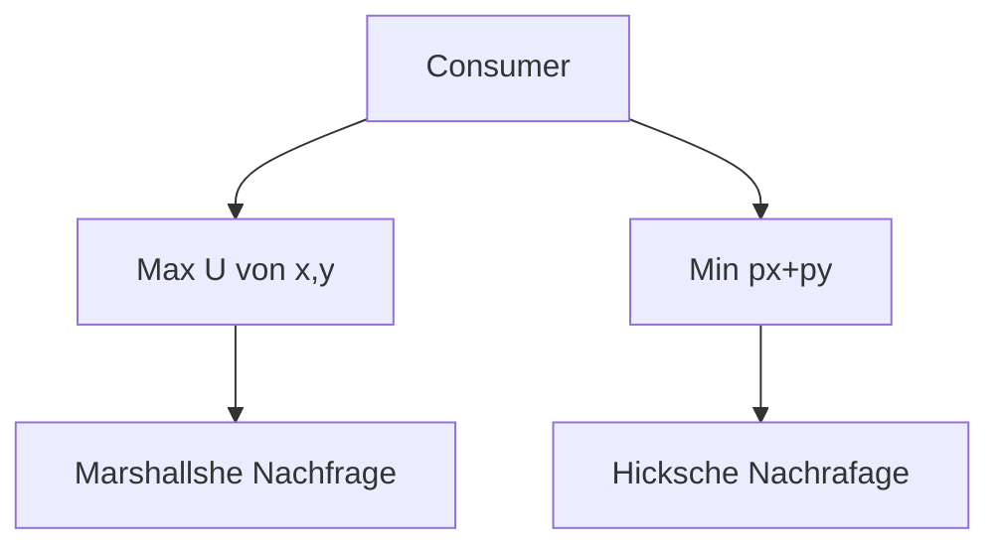
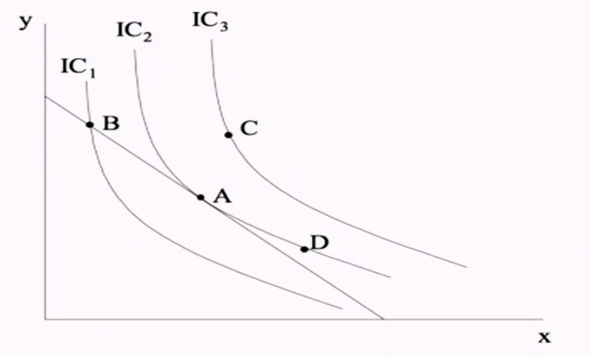
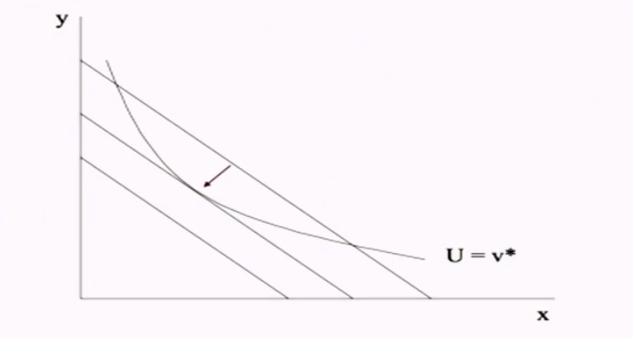

# 07.11.2022 Hicksche Nachfragefunktion

## Ausgabefunktion

Dualität der Axiome

> **Hicksian Demand**: Minimiere Kosten von gegebenem Nutzenniveau

> **Marshallan Demand:** Maximiere Nutzen bei gegebenem Preis

Lösung des Hickschen Problems ergibt $x^*,y^*$ (als Funkltion von $p_x,p_y,u$) und Einsetzen in Kostenfunktion liefert **Ausgabenfunktion**

| Nutzenmaximierung                          | Kostenminimierung                          |
| ------------------------------------------ | ------------------------------------------ |
| $Max \ U(x,y) \ s.t. \ p_x x+ p_y y \le I$ | $Min \ p_x x+ p_y y \ s.t. U(x,y) \ge u^*$ |
|   |   |

Bedingung beides gleich: MRS = MRT

## Lösung des Optimierungsproblems

Annahme: $U(x,y) = x^{1/2} y^{1/2}$
$$
\text{Min } \ p_x x+ p_y y \ \text{  s.t. } U(x,y) \ge u^* \\
L = p_x x+p_y y + \lambda (U_p- x^{1/2} y^{1/2})
$$
Ableitung
$$
\begin{aligned}
I.\frac{\partial L}{\partial x} &= 
p_x - \lambda \frac{1}{2}x^{-1/2}y^{1/2}= 0\\
II.\frac{\partial L}{\partial x} &= 
p_y - \lambda \frac{1}{2}y^{-1/2}x^{1/2} = 0\\ 
III.\frac{\partial L}{\partial \lambda} &= U_p- x^{1/2} y^{1/2} = 0
\end{aligned}
$$
nach Lambda umformen und I. und II. gleichsetzen
$$
x = \frac{p_y y}{p_x}
$$
einsetzen in III.
$$
U_{p}= \left( \frac{p_{x}y}{p_{y}} \right)^{1/2} (y^*)^{1/2} \\
\to y^* = \left( \frac{p_{x}}{p_{y}} \right) ; 
x^* = \left( \frac{P_{x}}{P_{y}} \right)
$$
