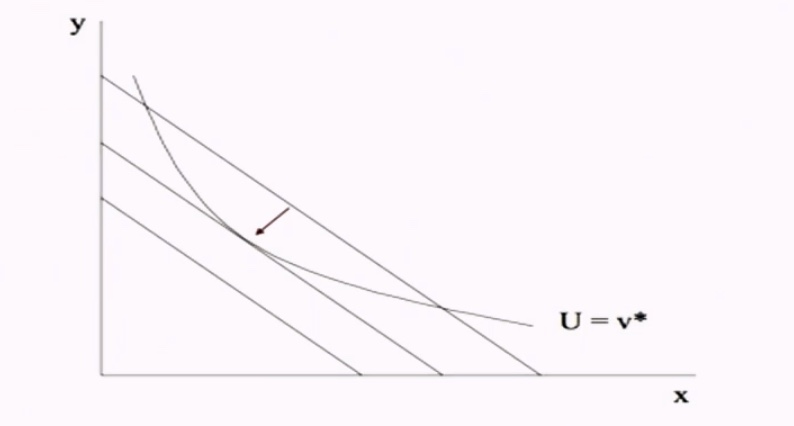

# 07.11.2022 Hicksche Nachfragefunktion

## Ausgabefunktion

Dualität der Axiome

```mermaid
graph TD
Consumer --> a[Max U von x,y] & b[Min px+py]
a --> c[Marshallshe Nachfrage]
b--> d[Hicksche Nachrafage]
```

> **Hicksian Demand**: Minimiere Kosten von gegebenem Nutzenniveau

> **Marshallan Demand:** Maximiere Nutzen bei gegebenem Preis

Lösung des Hickschen Problems ergibt $x^*,y^*$ (als Funkltion von $p_x,p_y,u$) und Einsetzen in Kostenfunktion liefert **Ausgabenfunktion**

| Nutzenmaximierung                          | Kostenminimierung                          |
| ------------------------------------------ | ------------------------------------------ |
| $Max \ U(x,y) \ s.t. \ p_x x+ p_y y \le I$ | $Min \ p_x x+ p_y y \ s.t. U(x,y) \ge u^*$ |
|   |   |

Bedingung beides gleich: MRS = MRT

### Lösung des Optimierungsproblems

Annahme: $U(x,y) = x^{1/2} y^{1/2}$
$$
\text{Min } \ p_x x+ p_y y \ \text{  s.t. } U(x,y) \ge u^* \\
L = p_x x+p_y y + \lambda (U_p- x^{1/2} y^{1/2})
$$
Ableitung
$$
\begin{aligned}
I.\frac{\partial L}{\partial x} &= 
p_x - \lambda \frac{1}{2}x^{-1/2}y^{1/2}= 0\\
II.\frac{\partial L}{\partial x} &= 
p_y - \lambda \frac{1}{2}y^{-1/2}x^{1/2} = 0\\ 
III.\frac{\partial L}{\partial \lambda} &= U_p- x^{1/2} y^{1/2} = 0
\end{aligned}
$$
nach Lambda umformen und I. und II. gleichsetzen
$$
x = \frac{p_y y}{p_x}
$$
einsetzen in III.
$$
U_{p}= \left( \frac{p_{x}y}{p_{y}} \right)^{1/2} (y^*)^{1/2} \\
\to y^* = \left( \frac{p_{x}}{p_{y}} \right)^{\frac{1}{2}}U_{p} \\
\to x^* = \left( \frac{P_{x}}{P_{y}} \right)^{\frac{1}{2}}U_{p}
$$
einsetzen in zu minimierende Kosten
$$
E(p_x,p_y,U_p) = 
p_x \cdot \left( \frac{p_{x}}{p_{y}} \right)^{\frac{1}{2}}U_{p} + 
p_y \cdot \left( \frac{p_{x}}{p_{y}} \right)^{\frac{1}{2}}U_{p} \\
\implies E(p_x,p_y,U_p) = 2p_x^{1/2} p_y^{1/2} U_p
$$

### Dualität der Funktionen

Zusammenhang zwischen den Funktionen

indirekten Nutzenfunktion = Ausgabenfunktion

### Wozu Ausgabenfunktion

- hier ist Interpretation ordinal (man kann Werte ablesen die was bringen)
- Nutzenniveau wird in Kosten "übersetzt" (**money metric**)
- erlaubt Policy Bewertung einer Maßnahme
    - durch Kompensationszahlungen vor / nach

Arten der Kompensationszahlungen:

- CV: Compensating Variation
    - Zahlung als Ausgleich des verlorenen Nutzens
- EV: Äquivalende Variation
    - wie viel sind wir bereit für Maßnahmenverhinderung zu zahlen

Beispiel: Gaspreis wird erhöht von $s_0$ auf $s_1$

- dann $CV = E(s_0,p_a, U_0)- E(x_1,p_a, U_0)$
    - Zahlung bei unveränderten Anderen Preisen für Ausgleich des verlorenen Nutzens
    - für Kosten-Nutzen-Analysen
    - Ex-post-Perspektive
- $EV = E(s_0,p_a,U_1)-E(s_0,p_a,U_0)$
    - Bereitschaft des Konsumenten, die Erhöhung zu verhindern
    - für Wohlfahrtsverlust von Maßnahmen
    - Ex-ante-Perspektive

das ist besser als Konsumenten preislich direkt zu entlasten, da dass zu Überkompensation führt

## Carte-Blanche–Prinzip

zu deutsch: Blankoscheck

Aus dem mikroökonomischen Ansatz folgt, dass Geld geben immer besser ist als Güter geben!

- freie moneätre Transferzahlung schwach gegenüber anderen Leistungen vorgezogen
- in Realität: zweckgebundene Zahlungen (Wohngeld, ...)

empirisch aber: ungebundene Transferzahlungen sind besser und werden nicht verschwendet

