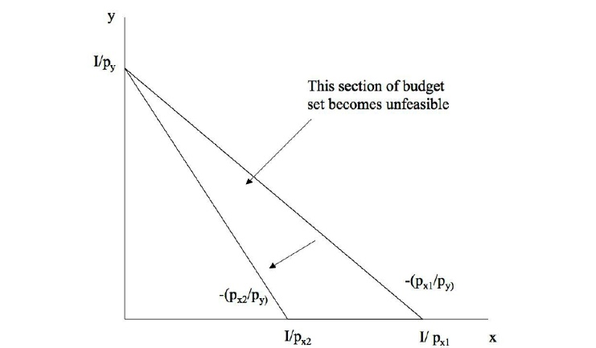
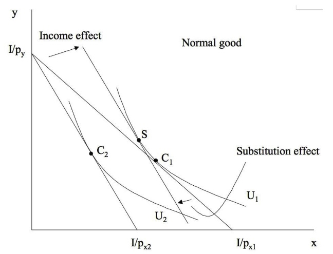
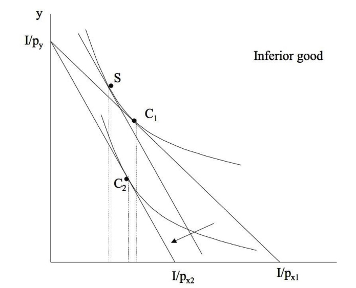
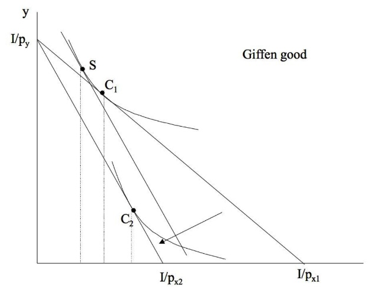
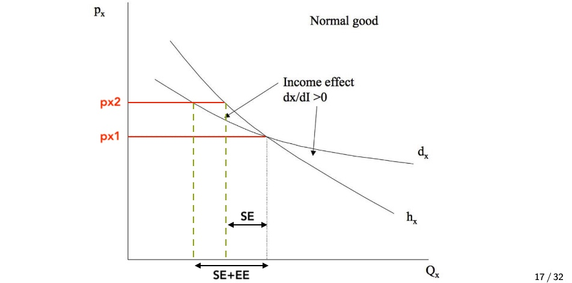

# 13.11.2022 Effekte und Arten von Gütern

## Einkommens und Substitutionseffekte

Effekte einer Preisänderung:

- relative Wert des Einkommens = *Fläche unter Geraden*
- Preisverhältnis = *Steigung der Geraden*

Hier: Preissteigerung $x_1$

Unterteilung in:

> **Substitutionseffekt:** die Nachfrageänderung nach einem Gut, die sich infolge einer Änderung der relativen Preise (d. h. des Preisverhältnisses) ergibt

Substitutionseffekt = **immer negativ!**  (Preis steigt => Menge sinkt)

> **Einkommenseffekt:** die Änderung der Nachfrage nach einem Gut, die sich infolge einer Änderung des (realen) Einkommens einstellt

- kann positiv sein = **normales Gut** (weniger/mehr Einkommen -> weniger/mehr Nachfrage)
- kann negativ sein = **inferiore Güter** (mehr Einkommen -> weniger Nachfrage)

Zerlegung der Effekte durch:

- **Hicks-Zerlegung:** wenn wir Konsumenten für Einkommenseffekt kompensieren würden, wie hätte sich dann trotzdem sein Verhalten aufgrund von Preisverhältnis geändert
- **Slutsky-Zerlegung:**  Oder wir kompensieren, so dass Original Güterbündel erreichbar ist

## Arten von Gütern

| Gut                                                          | Effekte         | Grafik                                            |
| ------------------------------------------------------------ | --------------- | ------------------------------------------------- |
| **normales Gut**: höherer Preis = niedrigere Nachfrage       | SE -> EE ->     |          |
| **schwach inferiores Gut** = mehr Einkommen = weniger Nachfrage | **SE ->** <- EE |  |
| **stark inferiores Gut (Giffen)** = höherer Preis = höhere Nachfrage | **EE ->** <-SE  |          |

## Kompensierte / unkompensierte Nachfrage

Nachfragefunktionen: Änderung der nachgefragten menge bei Preisänderung

- Marshallsche Nachfrage misst Gesamteffekt = **unkompensiert**
- Hicksche Nachfrage bezieht sich nur auf andere Preise und Nutzeniveau = **kompensiert**

=> Hicksche misst *Substitutionseffekt*

Hicksche Nachfragefuntkion ($h_x$) bei Niveau U = Marshallsche Nachfrage $d_x$ bei Einkommen für gleiches Nutzenniveau
$$
h_x(p_x,p_y, \bar{U}) = d_x(p_x,p_y, \underbrace{E(p_x,p_y,\bar{U})}_I)
$$
also an Ausgangspunkt treffen sich beide, sonst verlaufen sie unterschiedlich! (abhängig von Güterart)

anhand der Verläufe lassen sich die Effekte extrahieren

## Shephards Lemma und Slutsky Gleichung

Stephards Lemma 
$$
\underbrace{\frac{\partial d_x}{\partial p_x}}_{1.} = 
\underbrace{\frac{\partial h_x}{\partial p_x}}_{2.} - 
\underbrace{\frac{\partial d_x}{\partial I_{}}}_{3.} \cdot
\underbrace{\frac{\partial E}{\partial p_x}}_{4.}
$$

1. Änderung unkompensierte Nachfrage
2. Änderung der kompensierten Nachfrage
3. Änderung der Nachfrage bei kleiner Einkommensänderung
4. Optimal nachgefragte Menge = $h_x$ = **Shephards Lemma**

was heißt das bitte?

bei *ganz kleiner* Preissteigerung = keine Reoptimierung der Güter = direkte Kompensation kann helfen 

Beispiel: Wenn Sie jeden Tag 2 Kaffee in der Mensa kaufen und der Preis
um 1 Cent steigt, brauchen Sie 2 Cent mehr, um das Nutzenniveau von
vor der Preiserhöhung (U) halten zu können

---

Slutsky Gleichung: zeigt Zusammenhang zwischen beiden Nachfragefunktionen
$$
\frac{\partial d_x}{\partial p_x} = \frac{\partial h_x}{\partial p_x} - \frac{\partial d_x}{\partial I }-x
$$
Arten der Güter werden sichtbar

- Normales Gut: $\frac{\partial d_x}{\partial p_x}<0$
- Inferiores Gut $\frac{\partial d_x}{\partial I} < 0$
    - schwach inferior, wenn dennoch $\frac{\partial d_x}{\partial p_x} < 0$
    - Giffen Gut, wenn $\frac{\partial d_x}{\partial p_x}>0$

