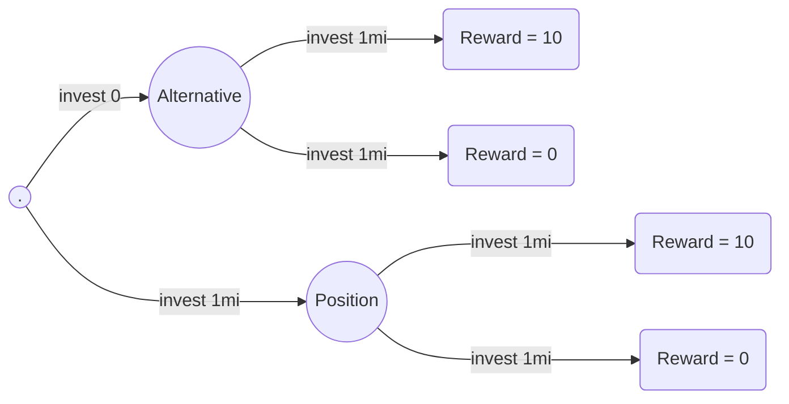
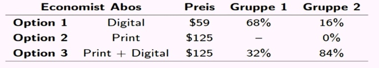
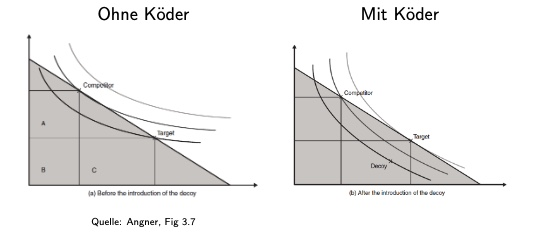

# 20.11.2022 Verhaltensökonomik I

die Abweichungen von der rationalen Theorie: 

## Opportunitätskosten

> **Opportunitätskosten:** implizite Kosten durch Nichtwählen der nächstbesten Alternative

**Realität**: der Mensch wählt nicht alles rational! (nimm das Mikroökonomik :fist_oncoming: )

**Problem**:

- alle Alternativen kennen
- ihr Nutzen bewerten möglich

## Sunk Costs

> **Sunk Costs**: bereits angefallene, irreversible Kosten.

- Spielen in Standardtheorie keine Rolle für Entscheidungen

Beispiel Kostenentscheidungen

an sich sollte diese Entscheidung zufällig sein an der Position, aber realisitisch wird sich immer für ersteres entschieden

=> *Sunk Cost Fallacy*

## Abhängigkeit von irrelevanten Alternativen

schlechtere Alternativen sollten keinen Einfluss haben auf Entscheidungen (*Decoy Effekt*)

> **Decoy Effekt:** wenn x aus Menge {x,y} ausgewählt, und das ist rational; dann y aus {x,y,z} ist irrational!

Realität; passiert, wenn man schlechtere Alternative hinzufügt, sieht anderes wie guter Deal aus

Beispiel: Abonnements des Economist

- Gruppe 1: Option Digital und Print
- Gruppe 2: alle 3 Optionen

Eigentlich sollte das gleiche sein in den Prozentzahlen von Option 1 und 3

=> durch schlechte Alternative wird andere Entscheidung gewählt

Erklärung: 

## Endowment Effekt

> **Endowment Effekt:** Präferenzen über Alternativen hängen von Besitz des Individuums ab (seinem "Endowment")

- Präferenzen hängen ab von Referenzpunkt
- wir mögen unseren Besitz sehr = Verlustaversion

> **Verlustaversion:** Menschen leiden mehr, wenn sie etwas verlieren als wenn sie den gleichen Betrag bekommen

Beispiel: Geld oder Lottoticket

Merke: der Gegenstand, den man besitzt ist nicht an sich attraktiver, nur Aufgeben ist schwieriger

## Verlustaversion im Modell

### Wertfunktion

- zentrales Element der Prospekt Theorie
- modelliert Nutzen oder Wert von Änderungen der Ausstattungen
- Eigenschaft: Verlust = höherer Rückgang als Gewinn

Beispieldefinition:
$$
v(x) = 
\begin{cases}
x/2&for\  x\geq 0\text{ (gains)}\\
2x&for \ x < 0 \text{ (losses)}
\end{cases}
$$
=> Referenzpunkt ist wichtig für Bewertung

Beduetung für Mirko:

- Indifferenzkurve ist unumkehrbar
- IDKs können Knick haben (abhängig von Referenzpunkt)

### in der Realität

- Aktienmärkte
    - verkaufen zu früh bei steigenden Preisen
    - und zu spät bei Verlusten (um nicht zu realisieren)
- Immobilinemärkte
    - Weiderverkaufspreis hängt ab von Original-Kaufpreis
- Arbeitnehmer- Lohntabellen

Feldexperimente:

- Arbeitnehmer in China
- zwei Bezahlungssysteme
    - Gehalt + Abzug bei geringer Produktivität
    - Gehalt + Bonus bei hoher Prod.
- erste Situation = besser

