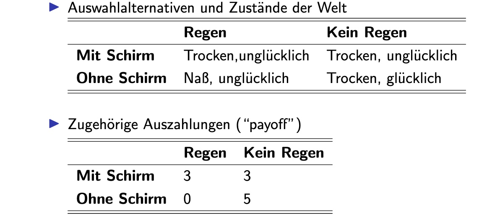

# 30.11.2022 Risiko und Unsicherheit

Entscheidung unter **Unsicherheit**:

- unklar über Wahrscheinlichkeiten anderer Zustände der Welt
- Beispiel Schulschließungen

Entscheidung unter **Risiko**

- Warhrscheinlichkeiten sind bestimmbar und bekannt
- Beispiel Impfung

## Unsicherheit

Ergebnisse der verschiedenen Zustände der Welt bekannt, aber Wahrscheinlichkeiten nicht

- Entscheidungen haben ein Minimalergebnis und ein Maximalergebnis
- Bsp.: Lottospielen; Min=0, Max=100Mio.

Entscheidungsregeln:

- **Maximin**: wähle Alternative mit größtem Minimum
- **Maximax**: Alternative mit größtem Maximum
- **Minimax-Regret**: wähle Alternative mit kürzestem Bedauern

Beispiel: Regenschirm mitnehmen

Bedauern: Differenzen in einer Spalte:

|                 | Regen   | kein Regen |
| --------------- | ------- | ---------- |
| **mit schirm**  | 0       | 2 (=3-5)   |
| **ohne schirm** | 3 (0-3) | 0          |

Entscheidungen:

- Maximin: Schirm mitnehmen
- Maximax: kein Schirm

## Risiko

### Erwartungswert

ab jetzt: Wahrscheinlichkeiten bekannt

Beispiel Lotterie:

- Liste Ereignisse $(S_1,\dots,S_n)$
- mit Wahrscheinlichkeiten $(Pr_1, ..., Pr_n)$
- mit $\sum Pr_j = 1$
- und Outcomes $C_1,...,C_n$

Erwartungswert: $EV(Lotterie) = Pr(S_1) \times C_1+...$

Aber: Erwartungswert oft nicht psychologisch nachgewiesen

### Erwartungsnutzen

Expected Utility: Den Wert in eine Nutzenfunktion reinstecken
$$
EU(Lotterie) = Pr(S_1) \times U(C_1)+...
$$
erlaubt dann also abnehmenden Grenznutzen von Geld

### Petersburg Paradoxon:

Glücksspiel: Münze werfen bis Kopf kommt, für jede Runde Zahl das Vielfache von 2€

Nehme das Spiel an, für Einsatz von 1000€

Erwartungswert:
$$
EV= \frac{1}{2}2+\frac{1}{4}4+... = \infty
$$
Erwartungsnutzen: mit $u(x) = \log(x)$
$$
EU = \frac{1}{2} log(2)+\frac{1}{4}log(4)+... = 0.602
$$
Vergleich dazu: $log(1000) = 6.7$, also geld behalten

### Risikopräferenzen

Bei gleichem Erwartungswert einer sicheren Alternative und Lotterie ist Individuum:

- **Risikoavers**: wählt sichere Alternative
- **risikoneutral:** indifferent
- **risikoliebend**: wählt Lotterie