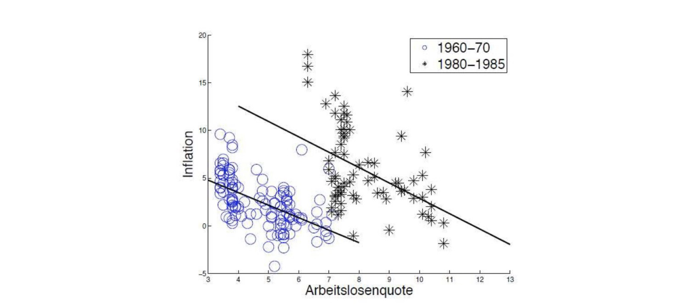
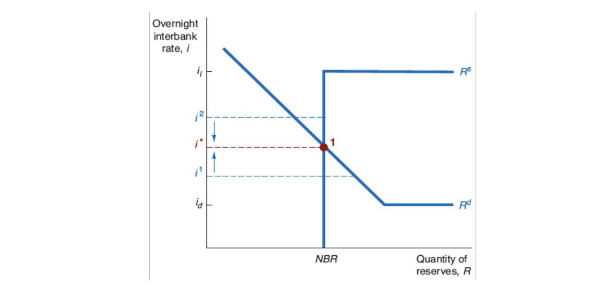
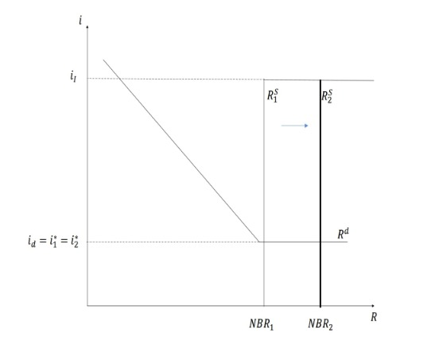
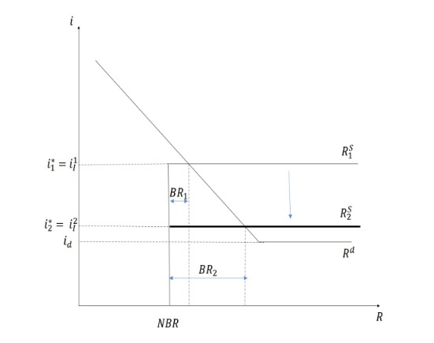
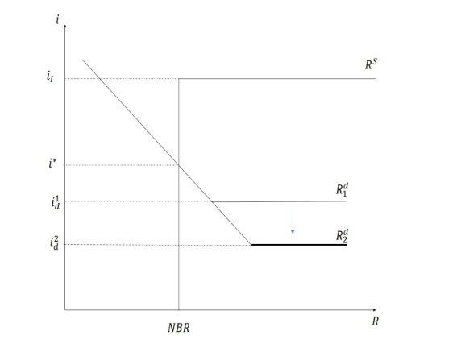
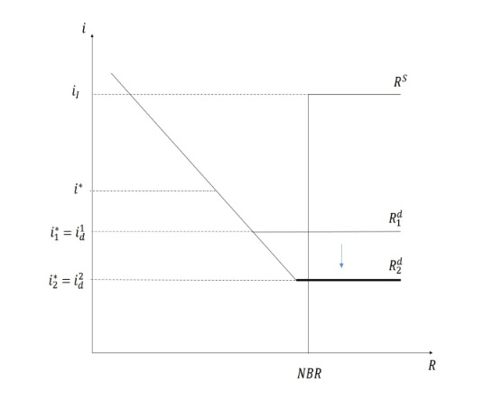
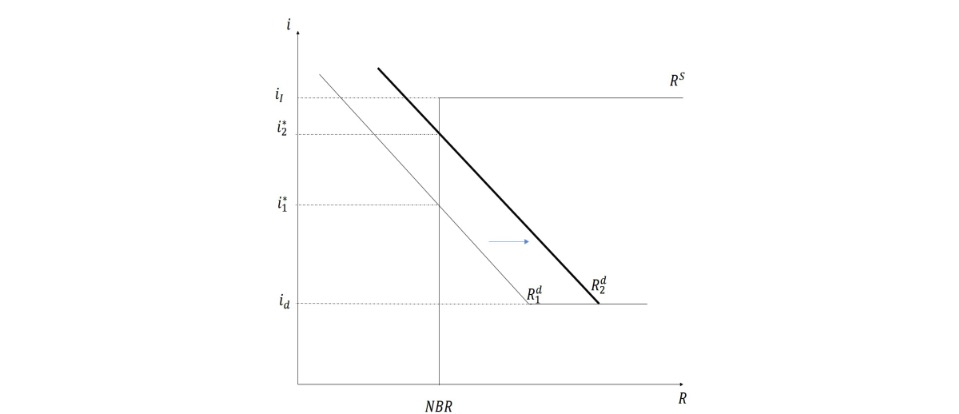
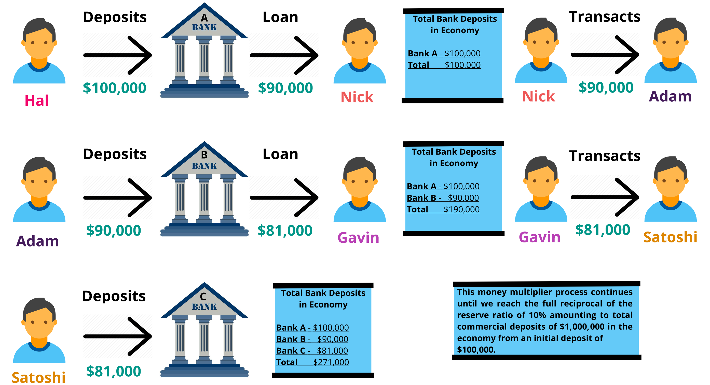

# Zusammenfassung Monetäre Ökonomik

Teilgebiet der Volkswirtschaftslehre, welches sich mit der Theorie des Geldes auseinandersetzt

* [**Zinsen**](#zinsen)
  + [Allgemein](#allgemein)
  + [Anleiheinstrumente](#anleiheinstrumente)
  + [Effektivzins](#effektivzins)
  + [Ertrag und Rendite](#ertrag-und-rendite)
  + [Realzins](#realzins)
* [**Zinsmarkt**](#zinsmarkt)
  + [Zinsbildung im Gleichgewicht](#zinsbildung-im-gleichgewicht)
  + [Kurvenverschiebungen](#kurvenverschiebungen)
  + [Zins und Ausfallrisiko](#zins-und-ausfallrisiko)
  + [Zins und Laufzeit](#zins-und-laufzeit)
* [**Finanzmarkt**](#finanzmarkt)
  + [Unterteilung](#unterteilung)
  + [Instrumente](#instrumente)
  + [Finanzintermediäre](#finanzintermediäre)
  + [Geschäftsbanken](#geschäftsbanken)
* [**Zentralbanken**](#zentralbanken)
  + [Ziele](#ziele)
  + [Vergleich EZB vs FED](#vergleich-ezb-vs-fed)
  + [Mittel](#mittel)
  + [Philipps Kurve](#philipps-kurve)
  + [Zentralbanken in Krisen](#zentralbanken-in-krisen)
  + [Zinssätze der Zentralbanken](#zinssätze-der-zentralbanken)
  + [Reservemarkt](#reservemarkt)
  + [Werkzeuge auf Reservemarkt](#werkzeuge-auf-reservemarkt)
  + [Transmissionskanäle](#transmissionskanäle)
* [**Geld**](#geld)
  + [Funktion](#funktion)
  + [Definitionen](#definitionen)
  + [Geldschöpfung Modell 1](#geldschöpfung-modell-1)
  + [Geldschöpfung Modell 2](#geldschöpfung-modell-2)
  + [Finanzinnovation](#finanzinnovation)
* [**Interessantes**](#interessantes)

## Zinsen

### Allgemein

> **Zinsen:** Preis für das Leihen / Verleihen von Geld

- beispielsweise auf Kredit, der in der Zukunft zurückgezahlt werden muss

### Anleiheinstrumente

- **einfacher Kredit**: vollständig am Anfang Auszahlung, vollständige Rückzahlung Ende + Zinsen
- **Ratenkredit:** vollständige Auszahlung Anfang, Abstotterung mit Teilzahlungen über Zeit
- **festverzinslichtes Wertpapier:** 
    - vollständige Auszahlung Anfang
    - Kuponzahlungen zwischendurch
    - vollständige Rückzahlung Ende
- **Nullkuponanleihe:** Teilauszahlung Anfang, Vollauszahlung Ende

### Effektivzins

Gegenwartswert einer zukünftigen Zahlung (*Cashflow CF*) mit Zins *i*

$$
PV = \frac{CF}{(1+i)^n}
$$

Effektivzins (Standard)

$$
i = \Big(\frac{CF}{PV}\Big)^{1/n} - 1
$$

Effektivzins Wertpapier:

$$
P = \frac{C}{(1+i)1} + \frac{C}{(1+i)^2} + ... + \frac{C+F}{(1+i)^n}
$$

#### Rechenbeispiel

Staatsanleihe (festverzinslichtes Wertpapier)

| Preis P | Rückzahlung F | Kupon C | Perioden n |
| ------- | ------------- | ------- | ---------- |
| 1000    | 1000          | 100     | 2          |

$$
P =& \frac{C}{(1+i)^1} + \frac{C+F}{(1+i)^2}\\
1000 =& \frac{100}{(1+i)^1} + \frac{100+1000}{(1+i)^2}  \\
&\implies i=10\%
$$

**=> sinkt der Preis, steigt der Effektivzins!**

### Ertrag und Rendite

berücksichtigt neben Zins die Preisveränderung eines Wertpapiers, bspw. für vorzeitigen Verkauf

$$
E = C + (P_{t+1}+P_t) \\
$$

Rendite = Ertrag / Preis

$$
R = \underbrace{\frac{C}{P_t}}_{i} + \underbrace{\frac{(P_{t+1}+P_t)}{P_t}}_{g \text{=Wertaenderung}}
$$

#### Rechenbeispiel

Kauf und Verkauf einer Staatsanleihe in darauffolgender Periode

| C    | F    | n    |
| ---- | ---- | ---- |
| 100  | 1000 | 1    |

Zinsunterschied von Periode 1 zu Periode 2:

- Veränderung des gesamtwirtschaftlichen Zinsniveaus
- das sind Opportunitätskosten der Staatsanleihe

| Kauf Periode 1:               | Verkauf Periode 2:            | Verkauf Periode 3                                    |
| ----------------------------- | ----------------------------- | ---------------------------------------------------- |
| $i_1 = 0.1$                   | $i_2 = 0.2$                   | mit Zins wie 2: $i_2=0.2$                            |
| $P= \frac{100+1000}{(1+0.1)}$ | $P= \frac{100+1000}{(1+0.2)}$ | $P = \frac{100}{(1+0.2)}+\frac{100+1000}{(1+0.2)^2}$ |
| $P=1000$                      | $P=917$                       | $P=847$                                              |

Rendite bei Verkauf in Periode 2

$$
R = \frac{100+(917-1000)}{1000} = 0.017
$$
Rendite bei Verkauf in Periode 3
$$
R = \frac{100+(847-1000)}{1000} = -0.053
$$

Statt bei Beibehaltung des ursprünglichen Niveaus:

- Verkauf jeweils 1000€

- $R=100/1000=0.1$

**=> Veräderung des Zinses = Veränderung des Preises**

**=> je länger die Laufzeit, desto größer das Risiko!**

### Realzins

inflationsbereinigter Effektivzins (nach Fischer)

$$
\underbrace{r}_{\text{Real}} = 
\underbrace{i}_{\text{Nominal}} 
- \underbrace{\pi^e}_{\text{Inflationserwartung}}
$$

- Investoren wollen gleichbleibenden Zins
- bei Inflationsanstieg werden dann höhere Effektivzinsen verlangt

**=> ein Anstieg der Inflation(serwartung) führt zu sinkenden Preisen**

## Zinsmarkt

### Zinsbildung im Gleichgewicht

von Angebot und Nachfrage auf Markt für Anleihen

- Nachfrage: Anleihepreis niedrig = hohe Zinsen = hohe Nachfrage
- Angebot: Anleihepreis niedrig = hohe Zinsen = wenig Angebot / Emissionen

### Kurvenverschiebungen

| Nachfrage                                  | Angebot                                       |
| ------------------------------------------ | --------------------------------------------- |
| Vermögen steigt: $D \rightarrow$           | Profit des Emittenten steigt: $S \rightarrow$ |
| Liquidität Anleihe steigt: $D \rightarrow$ | Inflation steigt: $S \rightarrow $            |
| Risiko Anleihe steigt: $D \leftarrow$      | Konjunktur: $S \rightarrow$                   |
| Inflation steigt: $D \leftarrow$           |                                               |

Inflation: doppelte entgegengesetzte Verschiebung!

### Zins und Ausfallrisiko

- Ausfallrisiko bestimmt Preis / Zins (höheres Risiko = höherer Zins)
- versicherbar mit **Credit Default Swaps**
- effektive Verzinsung = *risikoloser Zinssatz + Risikozulage*

Risikobewertung von Ratingagenturen (S&P, Moody, ...)

| Rang       | Investment Grade |      |      |      | Speculative Grade |      |
| ---------- | ---------------- | ---- | ---- | ---- | ----------------- | ---- |
| **Fitch**  | AAA              | AA   | A    | BBB  | BB                | ...  |
| **Moodys** | Aaa              | Aa   | A    | Baa  | Ba                | ...  |

Investment Grade etc. relevant für institutionelle Investoren

#### Krisen

- Risiko von Unternehmensanleihen steigt (Pleite)
- Preise sinken = Zinsen steigen

freigewordene Reserven = in sichere Staatsanleihen

- Zinsen sinken für diese

**=> in Krisen steigt Zinsdifferenz zw. Unternehmens- und Staatsanleihen**

### Zins und Laufzeit

Zinshöhe ist abhängig von Laufzeit

- kurze Laufzeit = geringer, da weniger Risiko von Inflation etc.
- längere Laufzeit = stärker, da höheres Risiko

Darstellung mit Zinsstrukturkurve

- in der Regel steigend
- Zinsen unterschiedlicher Laufzeiten bewegen sich ähnlich

*Warum?*

#### Erwartungstheorie

Annahme: Investoren indifferent zwischen zwei Anleihen unterschiedlicher Laufzeiten

- ob Anleihe mit Laufzeit 2 Jahre
- oder 2 Anleihen nacheinander mit Laufzeit 1 Jahr

$$
\underbrace{i_{n,0}}_{\text{langfristige Z.}} = 
\underbrace{
\frac{i_{1,0}+i_{1,1}^e+...+ i_{1,n}^e}{n}
}_{\text{kurzfristige Z.}}
$$

Erklärung Zins: $i_{n,t\text{ =Laufzeit, Emissionsjahr}}^{e \text{ =Erwartung}}$

**=> langfr. Zins hängt ab von Erwartungen von kurzfr. Zins!**

aber kann Anstieg der Kurve nicht erklären!

#### Liquiditätsprämientheorie

Annahme: Investoren mögen Sicherheit

- kurzfristige Anlagen eher als langfristige

$$
i_{n,0} = \frac{i_{1,0}+i_{1,1}^e+ i_{1,n}^e}{n} + \underbrace{l_{n,t}}_{\text{Prämie}}
$$

- Addition extra Prämie
- steigt mit Laufzeit

erklärt Anstieg der ZSK-Kurve

**=> langfr. Zins abhängig von kurzfr. Zins und Liquiditätspremium**

## Finanzmarkt

### Unterteilung

| Unterteilung                | Erklärung                                    |
| --------------------------- | -------------------------------------------- |
| Anleihemartk \| Aktienmarkt | Fremdkapital geben **vs**. Eigentümer werden |
| Primärm. \| Sekundärm.      | Neuausgabe **vs**. Handel mit bestehendem    |
| Geldm. \| Kapitalm.         | kurzfristig (<1Jahr) **vs**. Langfristig     |

### Instrumente

| Geldmarktinstrumente        | Kapitalmarktinstrumente       |
| --------------------------- | ----------------------------- |
| Schatzwechsel / Bankwechsel | Aktien                        |
| Unternehmenseinlagen        | Hypotheken                    |
| Geldmarktpapiere            | Anleihen (privat + staatlich) |

Außerdem *Repos*

> **Repo** (repurchase operation): kurzfristige Verkauf von Geld gegen Anleihen, mit Rückkaufvereinbarung (meist nächster Tag)

- also quasi besichert (mit den anleihepapieren)

### Finanzintermediäre

Organisationen wie Banken, die Handel organisieren

Vorteile:

- Bündelung Transaktionen (Reduzierung Transaktionskosten)
- Expertise
- Diversifikation
- Überkommen von asymmetrischen informationen
    - adverse Selektion (ex ante)
    - Moral Hazard (ex post)

=> **Finanzintermediäre sind "gut"**

### Geschäftsbanken

Intermediär mit starker staatlicher Überwachung 

Bilanz einer Geschäftsbank

| Aktiva                   | Passiva                        |
| ------------------------ | ------------------------------ |
| Langfristige Forderungen | kruzfristige Verbindlichkeiten |
| bspw. Kredite            | bspw. Sichteinlagen auf Konten |

**Problem:** Gefahr eines Bankruns

- alle wollen ihre kurzfristigen Verbindlichkeiten
- Bank hat nicht genug Reserven und kann nicht auszahlen

**Lösung:** Liquiditätsmanagement

- Beschaffung auf Interbankenmarkt
- Verkauf von Aktiva
- kurzfristiger Kredit bei Zentralbank (präferiert)

**=> Banken haben Angst vor Bankruns, deswegen Reserveanforderungen etc.**

## Zentralbanken

übergeordnete Behörde mit alleinigem Recht der Geldschöpfung und Kontrolle des Geldmarktes

### Ziele

- Preisstabilität
    - Informationsgehalt der Preise
    - Stabilität Investments
    - geringe Unsicherheit
    - Stopp kalter Progression
    - Stopp Umverteilung Leiher zu Schuldner
- Vollbeschäftigung (FED)
- Umweltschutz (sekundär)

### Vergleich EZB vs FED

|                          | EZB                              | FED                          |
| ------------------------ | -------------------------------- | ---------------------------- |
| **Name**                 | "Euopäische Zentralbank"         | "Federal Reserve System"     |
| **Teilnehemr**           | 19 Zentralbanken der Eurostaaten | 12 regionale Banken          |
| **Entscheidungsgremium** | EZB-Rat (Governing Council)      | Federal Open Markets Comitee |
| **Umsetzungsgremium**    | Direktorium (Executive Council)  | Board of Governors           |
| **Zielrate**             | ESTER (European Short Term Rate) | Federal Funds Rate           |
| **Unabhängigkeit**       | :white_check_mark:               | :white_check_mark:           |

Warum Unabhängigkeit?

- Geldpolitik basiert auf Glaubwürdigkeit
- Unabhängigkeit sichert Glaubwürdigkeit

**=> Glaubwürdigkeit ist schwer zu erlangen, aber einfach zu verspielen**

### Mittel

**konventionelle** Geldpolitik:

- Setzung der Zinsrate
- Mindestreserveanforderungen
    - Einlagen der Banken bei der ZB

- Kreditfazilitäten
    - Kredite der ZB an Geschäftsbanken

**unkonventionelle** Geldpolitik: *quantitative Lockerung*

- Anleiheankaufprogramme
    - bspw. PEPP (Pandemic Emergency Purchase Programm) der EZB

### Philipps Kurve

Zusammenhang zwischen Inflation und Arbeitslosigkeit

Annahmen:

- Preise der Firmen = Lohnkosten + x
    - Preisanstieg also auch
- Arbeitslosigkeit = Maß für Spannung am Arbeitsmarkt
    - mehr Arbeitslose = schwer Lohnfrderungen durchzusetzen

also negativer Zusammenhang:

- Höhe der Kurve verschiebbar (Stagflation)
- Geldpolitik also keine Reallohnzuwächse, nur Nominal 
- zu laxe Politik = Inflationstreibend

Wirkkanal: 

$$
\text{niedrige Zinsen} \implies 
\text{Überhitzung Wirtschaft} \implies
\text{niedrige ALQ} \implies
\text{hohe Inflation}
$$

**=> Zins hängt über Inflation mit Arbeitslosigkeit zusammen**

Aber: 

- es ist nicht zwingend ein Tradeoff
- und rückwärts nicht möglich: Inflation steigern für niedrigere ALQ

### Zentralbanken in Krisen

**Aufgabe**: Lender of Last Resort

- Bereitstellung Liquidität für Geschäftsbanken
- Bank Runs auf solide Banken verhindern
- Zusammenbruch des Finanzmarktes stoppen

**Mittel:**

- Kreditfazilitäten für alle
- Zinssenkung
- Offenmarktgeschäfte / Quantitative Lockerung

### Zinssätze der Zentralbanken

- $i$ = overnight interbank interest Rate
    - Satz, zu dem sich Banken gegenseitig leihen sollen
    - zentrale Rolle in gesamter Volkswirtschaft
- $i_d$ = deposit rate für Einlagen bei ZB
- $i_l$ = lending rate für Kredite von ZB

normalerweise: $i_l < i < i_d$

### Reservemarkt

wie ist die Nachfrage / Angebot von Reserven der Zentralbank?

- entscheidend ist der Zins auf dem Interbankenmarkt!
- Gut = Reservenscheine von der Zentralbank (quasi die 10€ Scheine)

| Nachfrage                                                 | Angebot                                                |
| --------------------------------------------------------- | ------------------------------------------------------ |
| "will ich an Zentralbank verleihen?"                      | "will ich von Zentralbank leihen?"                     |
| zu Zinssatz $i_d$                                         | zu Zinssatz $i_l$                                      |
| wenn Verleihen auf IB-Markt profitabler = wenig Nachfrage | wenn Leihen auf IB-Markt billiger = kein Angebot       |
| wenn $i \le i_l$ = unendliche Nachfrage                   | wenn $i \ge i_d$ = unendliches Angebot von ZB          |
| Mindestmenge = Reserveanforderungen                       | Mindestmenge = Non Borrowed Reserves aus Offenmarktop. |

Merke: y-Achse = Zinssatz auf IB-Markt! (also Opportunitätskosten)

Treffpunkt: $i^*$ = realisierter Zins auf IB-Markt

### Werkzeuge auf Reservemarkt

#### Offenmarktgeschäfte

- Zentralbank kauft Anleihen = mehr Angebot an Reserven 
    - aber Non-Borrowed Reserves!
- Angebotskurve verschiebt sich nach Rechts
- niedrigerer Schnittpunkt = niedrigerer Zins

außer wenn Angebotskurve schon auf horizontaler Nachfragekurve ist!

| Situation 1 mit Wirkung                                      | Situation 2 ohne Wirkung                                     |
| ------------------------------------------------------------ | ------------------------------------------------------------ |
|  |  |

#### Senkung Spitzenrefinanzierungssatz $i_l$

- keine Reaktion, da Gleichgewicht nicht berührt
- außer wenn $i_l = i$

| Situation 1 (ohne Wirkung)                                | Situation 2 (mit Wirkung)                                 |
| --------------------------------------------------------- | --------------------------------------------------------- |
|  |  |

#### Senkung Depositsatz $i_d$

- keine Wirkung, da Gleichgewicht nicht berührt
- außer wenn $i_d = i^*$

| Situation 1 (ohne Wirkung)                                | Situation 2 (mit Wirkung)                                 |
| --------------------------------------------------------- | --------------------------------------------------------- |
|  |  |

#### Mindestreserveanforderung Erhöhung

- erhöht Nachfrage nach rechts
- höherer IB-Zins

#### Zinssetzung

Zentralbank kann:

- Zinssätze setzen
- oder Geldmenge kontrollieren
- eines geht nciht bei anderem!
- meisten Zentralbanken präferieren Zinssetzung!

**=> Zentralbanken können entweder Zins setzen oder Geldmenge kontrollieren**

### Transmissionskanäle

wie wirkt die Geldpolitik der Zentralbank? hier am Beispiel einer **Zinssenkung**

- **Zinskanal**
    - aus Fischer Gleichung: Realzins = Nominal - Inflationserwartungen
    - Einfluss auf Nominalzins = `reiner Zinskanal`
    - Erwartungen veinflussen = `Erwartungskanal`
- **Vermögenswertkanal**
    - `Wechselkurskanal`
        - weniger Inv. aus Ausland + Abfluss Geld ins Ausland
        - nachfrage Währung sinkt = Abwertung
        - Billigere Exporte + Importsubstitution = mehr BIP!
    - `Tobins q`
        - Geldmengenausweitung auf Kapitalmarkt
        - Unternehmen einfacher Anleihen ausgeben
        - merh Investitionen = mehr BIP!
    - `reiner Wertkanal`
        - Vermögenspreisanstieg = mehr Einkommen
        - mehr Konsum = mehr BIP!
- **Kreditkanal**
    - `Bankkreditkanal`
        - Banken bekommen mehr Reserven = mehr Spielraum
        - mehr Kredite = mehr Inv. = mehr BIP
    - `Bilanzkanal` 
        - Unternehmenswerte = mehr wert = bessere Sicherheit
        - einfacher Kredite = mehr BIP

**=> Zinssenkung führt zu mehr BIP und höheren Preisen und vice-versa**

## Geld

### Funktion

- Tauschmittel
    - allgemeine Akzeptanz
    - senkt Transaktionskosten
- Recheneinheit
- Wertaufbewahrung

### Definitionen

von Geld und Geldmengen

1. M1: Währung (Papier) + Sichteinlagen (Girokonten)
2. M2: M1 + Termineinlagen < 2 J + Spareinlagen < 3 J 
3. M3: M2 + Geldmarktinstrumente < 1 J + Schuldverschreibungen < 2 J

also: $\text{Währung} \neq \text{Geld} \neq \text{Vermögen}$

**=> je breiter die Definition, desto größer die Menge**

### Geldschöpfung Modell 1

die *Fractional Reserve Theory*: Banken vermitteln Kredite

- Zentralbank kauft Anleihe von Bank A für 100.000€
- Bank hinterlegt 10% als Reserven, verleiht 90% weiter an  Kunde
- dieser nimmt mit zu anderer Bank etc, dort weiterverliehen etc.

Bilanz der Zentralbank

| Aktiva          | Passiva         |
| --------------- | --------------- |
| Anleihen +100k€ | Reserven +100k€ |

Bilanz der Bank A

| Aktiva        | Passiva |
| ------------- | ------- |
| Reserven +100 |         |
| Anleihen -100 |         |

Prozess vervielfältigen, dann wird Geldmenge mit Multipliaktor vervielfacht

| Rechnung                                                     | Visualisierung                                            |
| ------------------------------------------------------------ | --------------------------------------------------------- |
| $$\Delta Geldmenge = Multipliaktor \times \Delta Geldbasis \\Multiplikator = \frac{1}{Reserveanforderung}$$ |  |

- erklärt nicht den Wachstum der Kreditmenge vor Finanzkrisen!
- Widerspruch mit Zins als das primäre Politikinstrument

### Geldschöpfung Modell 2

die *Bankenschöpfungtheorie*: Banken erschaffen Geld

- Bank vergibt Kredit über Bilanzverlängerung
    - Sichteinlagen an Investor A
- der zieht das Geld ab, andere bringen es rein
- wenn Reserveanforderung nicht erfüllt -> IB-Markt

im Aufschwung:

- alle Banken vergeben Kredite aufgrund guter Aussichten
- alle brauchen Reserven = Zinsen steigen auf IB-Markt
- ZB will stabilen Zins = mehr Offenmakrtgeschäfte etc

im Abschwung:

- Kreditrisiko erhöht sich
- alle Banken wollen Reserven für kurzfristige Liquidität
- Kreditblase kann platzen = Kollaps

**=> Banken erschaffen Geld**

### Finanzinnovation

statt alter Kreditvergabe neue Arten

| altes Modell                             | neues Modell                             |
| ---------------------------------------- | ---------------------------------------- |
| Kreditvergabe gegen physische Sicherheit | Kreditvergabe gegen Wertpapiere          |
| Gewinn aus Zinsen                        | Gewinn aus Weiterverkauf der Forderungen |
| sorgfältige Auswahl Kreditnehmer         | wenig Auswahl und Checks                 |
| *originitate-to-hold*                    | *originate-to-distribute*                |

#### Verbriefung

> **Securization / Verbriefung:** Portfolioerstellung aus Einzelpositionen zur Risikostreuung

- Mischung von Krediten zu einer Assetklasse
- Kombinieren verschiedener Risiken
- Ratings von Ratingagenturen

Vorgehen:

1. Bank gründet *Special Purpose Vehicle SPV*
    - Verkauf aller Kredite dahin
2. SPV verbrieft und bündelt Kredite zu einzelnen Tranchen
    - verkauft an *Special Investment Vehicle* mit ABS
3. SIV verkürzt Laufzeiten und gibt Papiere aus
    - verkauft diese kurzfristig besicherten ABCP

Probleme:

- Investoren haben keine Transparenz über Schuldner / Werte
- langfristige Forderungen treffen kurzfristige Papiere
- Risiko Austrocknen kurzfristiger Finanzierung = kein Lender of Last Resort
- Kollaps einfach möglich

**=> riskante Innovation bündelt Kredite untersch. Laufzeiten & Risiken zu explosiver Mischung**

## Interessantes

**Film über das Finanzsystem**: [Oeconomia](https://www.zdf.de/filme/dokumentarfilm-in-3sat/oeconomia-104.html)

- Spielregeln des Finanzsystems
- von Carmen Losmann
- frei verfügbar beim ZDF

