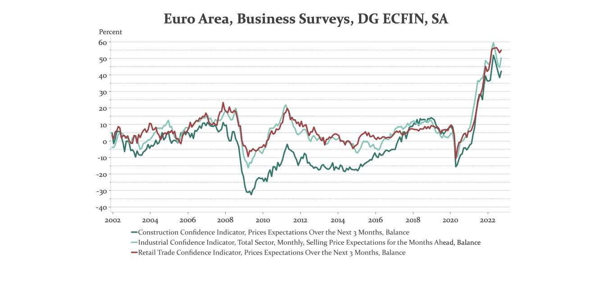

# 25.10.2022 Inflation

Inflationserwartungen im Euroraum

Reaktion der EZB = Reduktion der Anleihekäufe auf 0

=> fallende Preise => steigende Zinsen

## Zinsen und Renditen

*Ertrag = Kupon + Preisveränderung* $(P_{t+1} - P_t)$

*Rendite = Ertrag/Preis =* $\frac{C+P_{t+1}-P_t}{P_t}$

*Rendite =* $i_c+g$:

- Zinskupon $i_c = \frac{C}{P_t}$
- Wertänderung $g = \frac{P_{t+1}-P_t}{P_t}$

### Beispiel mit Laufzeit

Anleihen mit Preis = 1000, kupon = 10%

- Anleihe 1 = Laufzeit 1 Jahr
- Anleihe 2 = Laufzeit 5 Jahre

**Anleihe 1:** was passiert bei (Effektiv)-Zinsänderung?
$$
i=0.1: \; P = \frac{C+F}{(1+i)^1} =\frac{1000+100}{(1+0.1)^1}= 1000 \\
i=0.2: \; P = \frac{C+F}{(1+i)^1} =\frac{1000+100}{(1+0.2)^1}= \ 917
$$
**Anleihe 2:**
$$
i=0.1: P =  \frac{C}{(1+i)1} + \frac{C}{(1+i)^2} + ... + \frac{C+F}{(1+i)^n} \\
P = \frac{100}{(1+0.1)^1} + \frac{100}{(1+0.1)^2} + ... + \frac{1000+100}{(1+i)^n} = 1000 \\
i=0.2: P = \frac{100}{(1+0.2)^1} + \frac{100}{(1+0.2)^2} + ... + \frac{1000+100}{(1+2)^n} = 714
$$
**=> je länger die Laufzeit, desto stärker sinkt der Preis bei Zinssteigerung**

= Abdiskontieren der zukünftigen Zahlungen
$$
R_1 = \frac{C}{P_t}+ \frac{P_{t+1}-P_t}{P_t} = \frac{10}{1000}+ \frac{917-1000}{1000} = 1,7\% \\
R_2 = \frac{10}{1000}+ \frac{741-1000}{1000} = -15,9\% \\
$$
**Längerfristige Papiere = höheres Risiko**

## Realzinsen

**Fischer Gleichung:** Realzins = Nominalzins - Inflationserwartungen: $i_r = i-\pi^e$ 

Unterscheidung

- Ex ante Realzins = berücksichtigt Erwartungen
- Ex post = berücksichtigt realisierte Inflation

wichtiger Zins = realer Effektivzins

- steigen Erwartungen, verlangen wir höheren effektiven Nominalzins
- höherer Nominalzins => sinkender Papierpreis

**höhere Inflationserwartung => Rückgang Anleihepreise**

