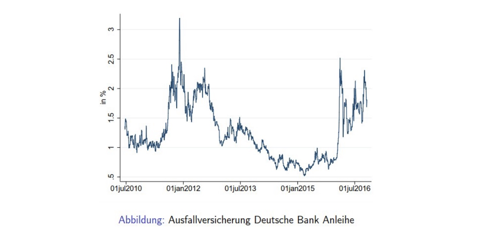
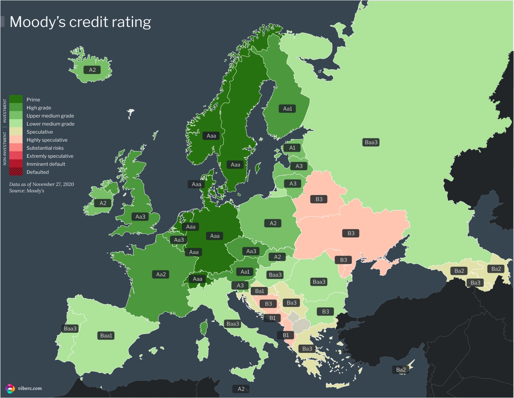
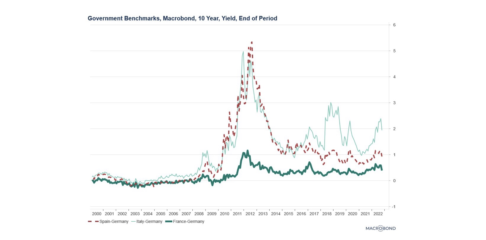

# 15.11.2022 Risiko

Zusammenfassung Erkenntnisse:

- Höhere effektive Verzinsung = niedrigerer Preis
- $P = \frac{C}{(1+i)^n}$
- Zinsen bilden sich im Gleichgewicht von A und N
- A und N sind durch verschiedene Faktoren beinflusst

## Ausfallrisiko

wichtiger Faktor für effektiven Zins

- senkt die Erwartung von C ( $C \downarrow$)
- steigert dadurch den Preis $P \uparrow$

### Absicherung

gegen Ausfallrisiko absichern 

- mit *Credit Default Swap*
- Prämie = Risiko des Zahlungsausfalls

### Risikoklassen

dieses Risiko = schwer ermittelbar

=> Schaffung von Institutionen zur Bewertung (*Moodys, S&P, Fitch*)

- Abkürzung mit Buchstaben
    - AAA (sehr sicher) bis D (Default = Ausfall)
    - Investment gerade = alles mit *A*

> **Note!**
>
> diese Agenturen werden von den Emittenten bezahlt! = *moral hazard* Problem!

### Krisen

- je höher Risiko = höherer Zins
- Zinsspread  varriert mit Zeit
- Besonders in Krisen hoch

Zinsspread Deutschland: 

in Krisen:

- private Ausfallrisiken steigen
- Investoren verkaufen Unternehmensanleihen
    - sinkende Preise der privaten Bonds => Zinsen rauf
- freigewordenes Geld in Staatsanleihen
    - steigende Preise Staatsanleihen => Zinsen runter

Zinsunterschiede zwischen Staatsanleihen:

- Beginn der 2000er: Investoren waren "gutgläubig", alles gleich bewertet
- 2012 Eurokrise, insb. Südländer Euroraum
- 2013 "whatever it takes" von Draghi = Absenken des Ausfallrisikos
- seitdem wird Ausfallrisiko "inharänt" mit eingepreist, nicht wie vor 08

