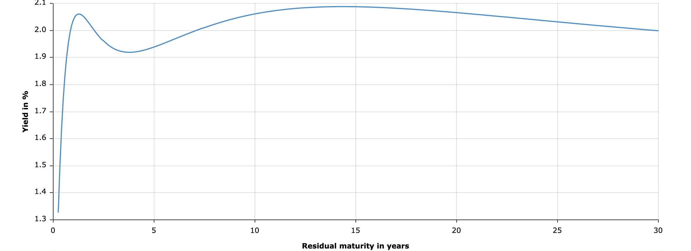
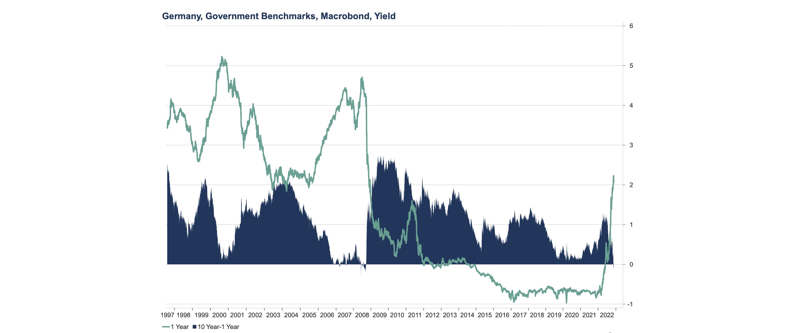
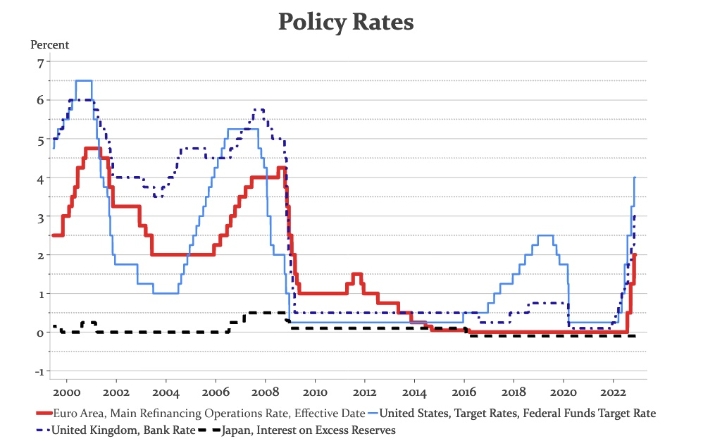

# 22.11.2022 Zinsstruktur

## Zinsstrukturkurve

Zusammenhang zw. Zinssatz und Restlaufzeit

je weiter in Zukunft, desto höher die Zinsen

Differenz zwischen 10jahres Bonds und kurzfristigen Bonds (1 Jahr):

- in Krisen sinkt Differenz 
- solange Fläche positiv = steigende Zinsstrukturkurve
- in Krisen = negativ
    - Staat nicht zahlungsfähig bei kurzer Frist

Regeln der Zinsstrukturkurve :

- negativer Zusammenhang: kurzfristige Zinsen niedrig <--> ZSK Steigung stark
- in der Regel ZSK ansteigend
- Zinsen unterschiedlicher Laufzeit bewegen sich ähnlich

Warum? verschiedne Theorien erklären das:

## Erwartungstheorie

Annahme: Anleihen zu unterschiedlichen Zeitpunkten = perfekte Substitute

- bei t=2: indifferent zwischen Strategien
    1. Anleihe mit Laufzeit = 2
    2. 2 Anleihen mit Laufzeit = 1

Strategie 1: 

- Cupon wird festgelegt = $i_2$
- Verzinsung nach 2 Perioden: $2 i_2 $

Weil $(1+i_2)(1+i_2) = \cancel{Inv}+ 2i_2+\cancel{(i_2)^2}$

Strategie 2:

- Kupon Periode 1: $i_{1,0}$
- Kupon Periode 2: $i_{1,1}^e$ (ist erwarteter Zins!)
- Verzinsung am Ende: $i_{1,0}+i_{1,1}^e$

Weil: $(1+i_1)(1+i_{1,1}^e) = \cancel{Inv} +i_1+i_{1,1}^e+\cancel{i_1 \ i_{1,1}^e}$

dann muss gelten:

$$
2 i_2 = i_1+i_{1,1}^e \\
\to i_2 = \frac{i_1+i_{1,1}^e}{2}
$$

Folgerung: erwartete Zinsentwicklung $i_{1,1}^e$ bestimmt langfristige Zinsen von heute ausgeben Anleihen $i_2$

Allgemein: 

$$
i_{n,0} = \frac{i_{1,0}+i_{1,1}^e+ i_{1,n}^e}{n}
$$

=> Zins über *n* Perioden = erwartete kurzfristige Zinsen über *n* Perioden

## Liquiditätsprämientheorie

Annahme: Anleihen unterschiedlicher Laufzeit =! perfekte Substitute

- Investoren Präferenz für kurzfristige Anleihen
- weil langfrristig = höheres Risiko

Theorie addiert dieses Risiko als Liquiditätsprämie $l_{n,t}$
$$
i_{n,0} = \frac{i_{1,0}+i_{1,1}^e+ i_{1,n}^e}{n} + \underbrace{l_{n,t}}_{\text{Prämie}}
$$

## ZSK und Geldpolitik

Beeinflussung der **langfristigen** Zinssätze mit 3 Optionen

### I. kurzfristigen Zinssätze 

Schärfstes Instrument der Zentralbanken

### II. Erwartungen über zukünfitge kurzfristige Zinssätze 

mit forward guidance = Kommunikation über über mittlere Zinssätze Erwartungen beeinflussen 

> the interest rate [...] will remain unchanged at 0.0%. 
>
> [We] expect the interest rates [...] to remain at their lower levels.
>
> ~ **PRESS RELEACE ECB**, October 2020

funktioniert nur über maximal 1-2 Jahre

### III. Anleihekäufe

= *Quantitative Easing*

mithilfe des Asset Purchase Program (APP)

- verschiedene Anlehenarten kaufen (Public Sector, Corporate Sector ...)

Idee

- mehr Ankäufe
- erhöhte Nachfrage nach langfristigen Anleihen
- ZSK ändern 
- von blau :large_blue_circle: zu grün :green_heart:

