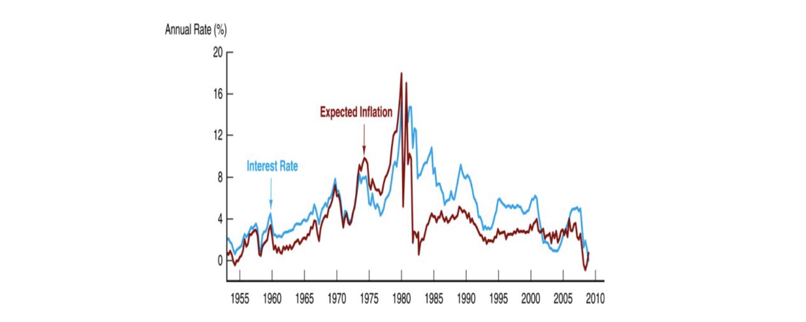
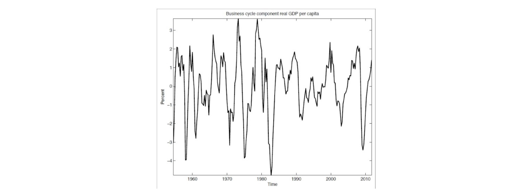
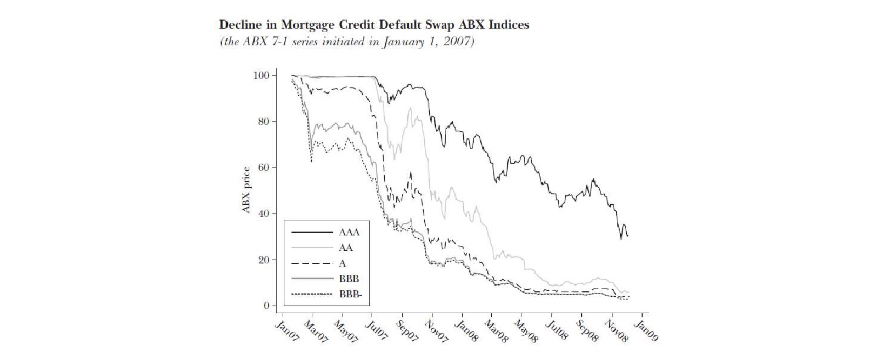

# 20.12.2022 Finanzkrisen

## Geldpolitik

- Unabhängigkeit wichtig
    - sonst Kauf von Staatsanleihen durch ZB
    - = Inflation (wenn falsch gemacht)
- nicht für dauerhaft/systematisch Finanzierung von Staatsdefiziten!

> Überziehungs- oder andere Kreditfazilitäten sind [..] ebenso verboten wie der *unmittelbare* Erwerb von Schuldtiteln
>
> **~ Maastricht Vertrag der EU**

Historisch: nicht immer vertrauenswürdiges Handeln

- in 70/80ern extreme Inflation
- Federal Reserve hebt Zinsen extrem an = *Volcker-Schock* (nach Chairman)

führte zu massivem Produktionseinbruch und tiefer Rezession

- größte Rezession von eigener ZB
- für die Glaubwürdigkeit
- extreme Folgen

**=> Glaubwürdigkeit schwer zu erlangen, einfach zu verspielen**

## Krise 2007-2009

- 2000er: Ausgabe vieler Hauskredite von Banken
- diese Hauskredite wurden gesammelt, verbrieft und verkauft
- dann Rating von Ratingagenturen (S&P, Moody, Fitch)

Problem: Downturn in den 2007ern

- Hauskredite werden nicht mehr bedient = Kollabiert

- keine Informationen über Lkquidität = Panik
- Zusammenbruch von Lehman Brothers = großes Institut
- Folgend: teilweise Verstaatlichungen in ganzer Welt

## Zentralbanken in Krisen

**Ideen**:

- *Lender of Last Resort* bis zum Schluss
- Liquiditätsprobleme lösen
- nur für solide Banken

**Maßnahmen**:

- Kreditfazilitäten für alle
    - ohne Stigmatisierung
- Zinsreaktionen
    - Quantitative Tightening, Verhindern von Deflation
- Offenmarktgeschäfte

**EZB vs. FED**:

- FED: schnelle Reaktion mit unkonventionellen Maßnahmen
- EZB: verlangsamte Reaktion zu spät
    - Bremsen von konservativen ZB (Bundesbank)
    - dadurch keine richtige Überwindung der Krise

