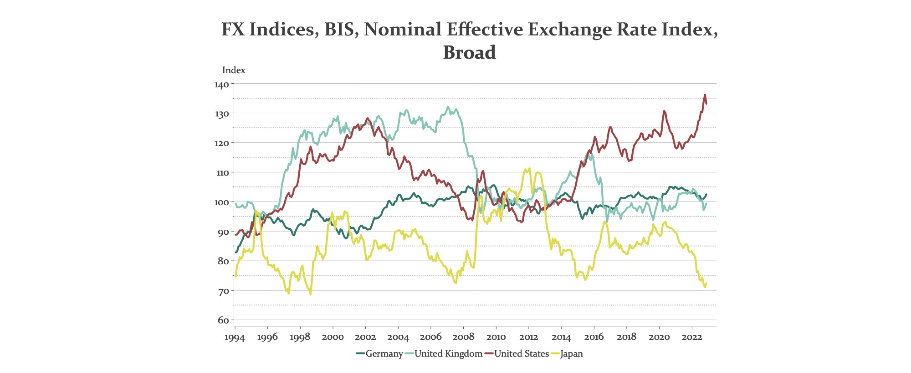
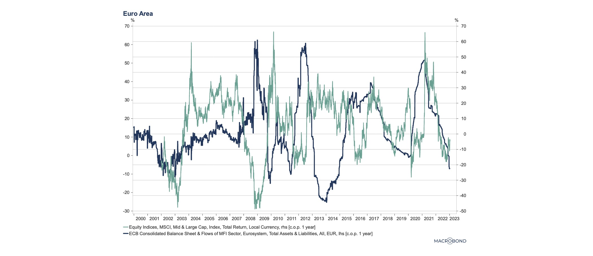
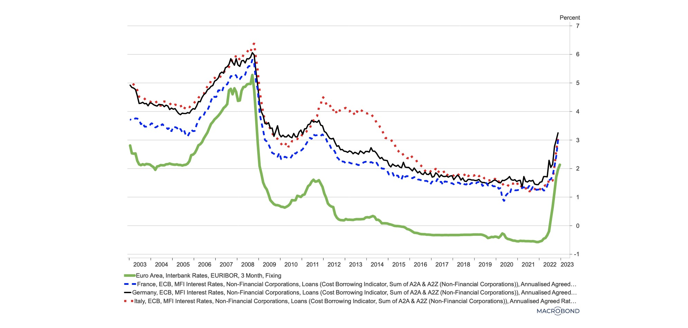

# 17.01.2023 Instrumente

## Effekte von Geldpolitik

wie wirkt die Politik?

Zinserhöhung:

- Kontraktion des BIP

- Rückgang der Preise

## Transmissionskanäle

über welche Maßnahmen wirkt die Politik?

### Zinsen

aus Fischer Gleichung: 
$$
Effektivzins = Nominalzins - Inflationserwartung
$$

Einfluss auf beides:

- Zinspolitik senkt **Nominalzins** (*Zinskanal*)
    - herkömmliche Politik
- und verändert **Erwartungen** (*Erwartungskanal*)
    - bspw. mit unkonventioneller Geldpolitik

### Vermögenswertkanal

3 Kanäle

##### Wechselkurskanal

- geringere Zinsen = weniger Auslandsinv.
- geringere Nachfrage nach Währung = niedrigerer Wechselkurs
- billige Währung = mehr Exporte = mehr BIP
- teuerere Importe = Substitution = mehr BIP

##### Tobins q 

= Marktwert des Kapitals

- erhöhte Geldmenge wird an Kapitalmarkt angelegt
- hohes q = Unternehmen geben gerne Anleihen aus
- Anreiz für Investitionen = mehr BIP

##### reiner Vermögenskanal

- Annahme: Konsumenten glätten Konsum über Zeit
- Erhöhung Einkommen = Erhöhung Konsum

- Vermögenspreisanstieg = mehr Konsum = mehr BIP

### Kreditkanal

##### Bankkreditkanal

- Grade im Euroraum = Banken spielen Rolle für Investitionen
- Offenmarktgeschäfte = mehr Reserven = mehr Spielraum
- mehr Kredite = mehr Investitionen = mehr BIP

Bankzinsen im Euroraum (heir Kanal besonders wichtig!)

##### Bilanzkanal

- Erhöhung der Firmenwerte = bessere Sicherheiten für Kredite
- solventere Firmen = geringeres Ausfallrisiko = weniger adverse Selektion

## Übung

### Zinskanal

- Annahme verzögerte Preisanpassung
- mit Fischer Gleichung Nominalzins und Erwartung veränderbar

bei Nullzinsgrenze:

- Zins kann nur ncoh mithilfe von Erwartungen gesteuert werden
- Erwartungskanal hochrelevant
- außerdem Einlagenzins wird relevanter 
    - bsp.: EZB Einlagenzins negativ (-0,5%)

### Wechselkurskanal

Zinsparitätsgleichung
$$
Zins_{Euro} = Zins_{Dollar} + \text{erwartete Abwertung Euro/ Dollar}
$$
Annahmen

- perfekte Substituierbarkeit
- Vollkommene Kapitalmobilität
- Gleichgewicht Kapital / Devisen

Interpretation:

- Erträge Inland = Erträge Ausland
- aber: Ertrag Ausland hängt ab von Zinsen + Wechelskursrisiko
    - potentielle Verluste durch Wechselkursänderung
- Wechselkurse Zukunft nicht bekannt => Erwartungsbildung

Funktion: Zins Inland (Europa) runter

- Inverstitionen Inland weniger attraktiv
- Abfluss ins Ausland 
- nachfrage nach Dollar steigt, Euro sinkt
- Dollar AUfwertung, Euro Abwertung 
    - Abwertung Inlandswährung
    - inlandsgüter relativ billiger (Inland und Ausland)
    - mehr Nachfrage nach EU-Gütern -> Exporte
    - mehr BIP

