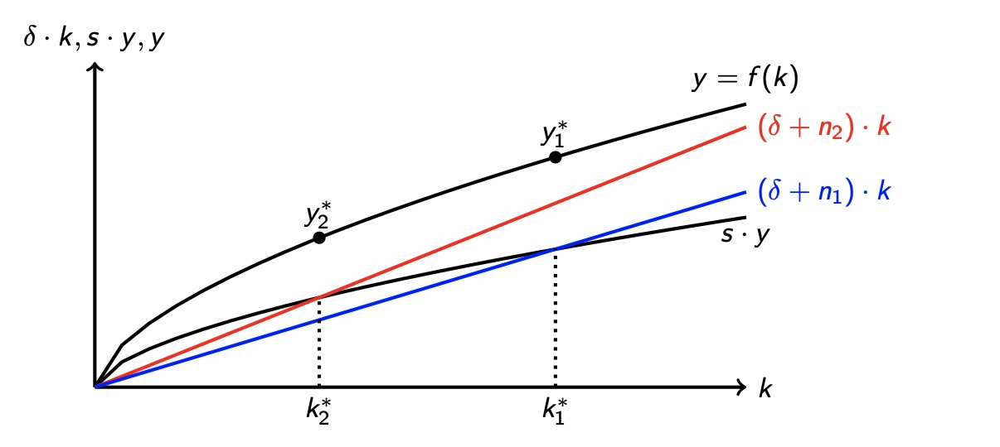
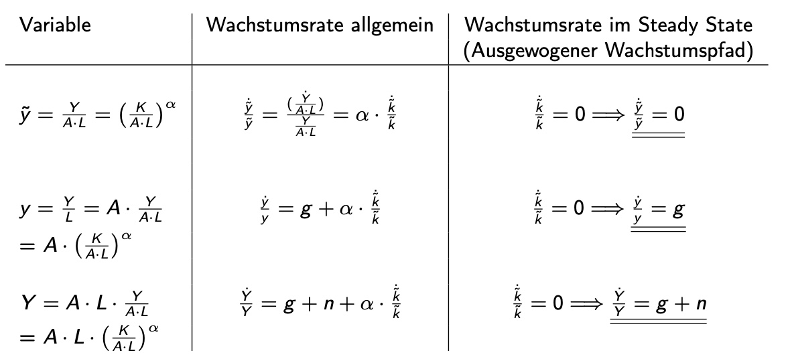

# 25.10.2022 Humankapital

## Erweiterung des Solow Modells

### Bevölkerungswachstum

Annahme: konstantes Wachstum der Bevölkerung mit Rate *n*: $L(t) = L(0) \cdot e^{nt}$

Dann Veränderung des Pro-Kopf-Kapitalstocks:
$$
\frac{\dot{k}}{k}=s\frac{y}{k}-\delta - \bf{n} \\
\to \dot{k} = sy-(n+\delta)k
$$
=> Bevölkerungswachstum heißt weniger Pro-Kopf-Kapital = weniger Wachstum

Steady State: (jeweils im Nenner nur das n zu $\delta$ addiert)
$$
k^* = \Big(\frac{s}{n+\delta}\Big)^{\frac{1}{1-a}} \\
y^* = (k^*)^a = \Big(\frac{s}{n+\delta}\Big)^{\frac{a}{1-a}}
$$
=> Bevölkerungswachstum heißt niedrigerer Steady State

### Technologischer Fortschritt

Fortschritt = Skalierungsfaktor in Cobb-Douglas-Produktionsfunktion = **Technologieniveau**
$$
Y = F(A,K,L) = F(K,A\cdot L) = K^a (AL)^{1-a}
$$

- Fortschritt hilft Arbeit = *labor-augmenting techn. progress*
- bei Cobb-Douglas aber irrelevant: $Y = A \cdot F(K,L)$
- Wachstum von A mit konstanter Rate *g*: $A_t = A_0 \cdot e^{gt}$

Einkommen und Pro-Kopf-Einkommen:
$$
Y = K^a (AL)^{1-a} \\
\implies y = k^a A^{1-a}
$$
Insgesamt: **Wachstumsrate A = Wachstumsrate y**
$$
\frac{\dot{k}}{k} = \frac{\dot{y}}{y} = \frac{\dot{A}}{A} = g
$$
= *balanced growth path*

Steady State = Kapitalstock pro **effektivem Arbeiter**
$$
\tilde{k}^* = \frac{k}{A} = \Big(\frac{s}{n+\delta+g}\Big)^{\frac{1}{1-a}} \\
\tilde{y^*} = (\tilde{k}^*)^a = \Big(\frac{s}{n+\delta+g}\Big)^{\frac{a}{1-a}}
$$

echtes Pro Kopf = nicht effektiver arbeiter, also alles mit A multiplizieren

A bekommen wir aus Produktionsfunktion
$$
Y = K^a (AL)^{1-a} \\\to A= \Big(\frac{Y}{K^a L^{1-a}}\Big)^{\frac{1}{1-a}} \\
y^* = A \cdot (k^*)^a = A \cdot\Big(\frac{s}{n+\delta+g}\Big)^{\frac{a}{1-a}}
$$

Insgesamt: 

