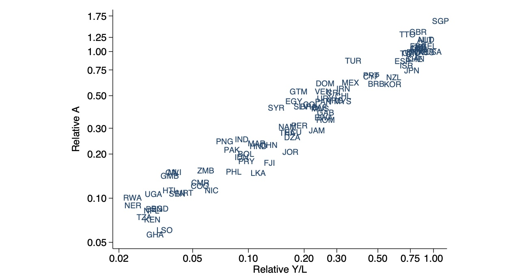
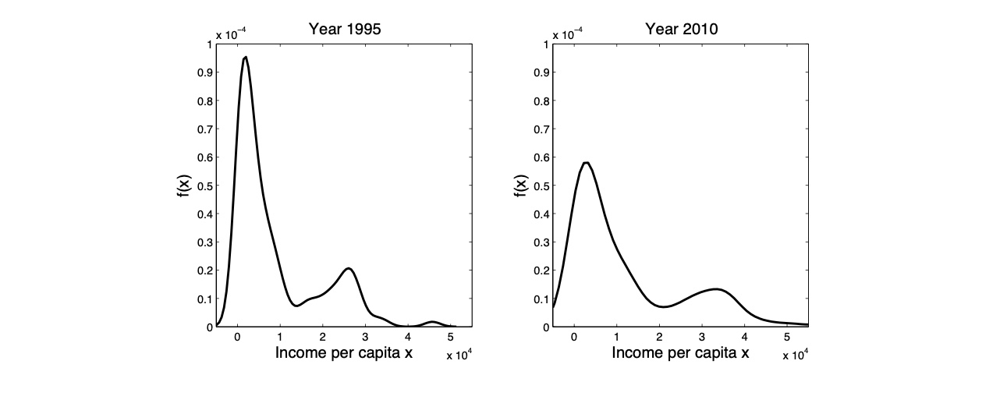
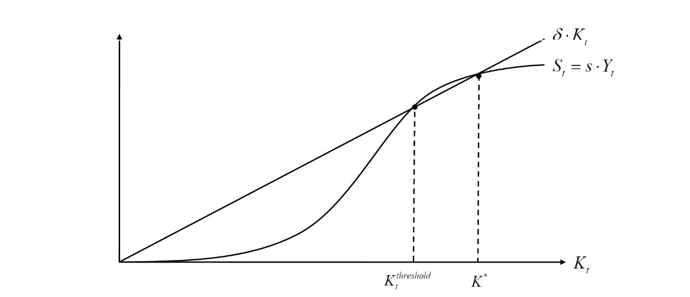

# 01.11.2022 Konvergenz

## Solow und Empirie

### Vorhersagen

Vorhersage des Pro-Kopf-Einkommens anhand der Faktoren des Solow Modells

- $A$  = Technologielevel
- $s$ = Sparquote
- $n$ = Bevölkerungswachstum
- $u$ = Bildungsjahre

Annahmen: 

- $\alpha, \psi, \delta, g$ sind konstant über alle Länder hinweg
- alle Länder sind im Steady State

### Indien - USA

| Vergleich (1969-2008) | Indien | USA   |
| --------------------- | ------ | ----- |
| s                     | 0.241  | 0.202 |
| n                     | 0.017  | 0.011 |
| u                     | 4.23   | 13.24 |

$a=\frac{1}{3}, \psi = 0.1, \delta+g = 0.075$

Ergebnis: unter Annahme gleicher Technologie hat Indien 43% des BIP p.P von USA

**real: Indien hat 10% des BIP p.P**

### Bedeutung der Technologie A

Berechnung: implizit aus Produktionsfunktion 

- wird als **Solow-Residuum** bezeichnet = alles was nicht durch Faktoren abgedeckt wird
- oft wird mit relativem zu USA gearbeitet $\hat{A}_i = \frac{A_i}{A_{US}}$

Synthetische Beispielländer: (im Vergleich zu US)

und dann Berechnung:

anhand der realen Welt: 

=> wir sehen, dass dieses Residuum fast die gesamten Unterschiede abdeckt

### Zerlegung

die reichsten Länder sind 40 Mal so reich wie ärmste 

Zerlegung des Faktors:

- Sparquote = 2
- Humankapital = 2
- Residuum = 10

$\hat{A}$ =**measure of our ignorance**

=> Solow Modell ist nicht besonders geil

## Wachstumsunterschiede

- ärmere Länder sind noch nicht im Steady State 
- sie sollten sowohl technoligischen Fortschritt als auch Kapitalakkumulation haben
- entwickelte Länder haben nur ersteres

### Beta-Konvergenz

= unbedingte Konvergenz

=> negativer Zusammenhang von BIP p.P und Wachstumsrate

empirisch anhand Regression bestimmt

**=> funktioniert nicht**, da nicht alle Länder gleichen Steady State haben

#### Alternative

Länder mit ähnlichem Steady State ansehen 

- bspw. entwickelte Volkswirtschaften (OECD)
- ähnliches A und h

### Club Konvergenz

Es gibt 2 Arten von Ländern auf der Welt (arm und reich)

- dazwischen gibt es eine Middle Income Trap

**=> früher eher ja, heute eher nein**

### Fazit zu Konvergenz

`! Klausurrelevant !`

- unbedingte Beta-Konvergenz (alle gleicher Steady State) = **nein**
- bedingte Beta Konvergenz = **eher ja**
- sigma Konvergenz (Rückgang der Varianz von Einkommen) = **nein**
- Club Konvergenz = **heute eher weniger**

## Poverty Traps

> **Armutsfalle:** Selbstverstärkender Mechanismus, wodurch Länder auf niedrigem Niveau verbleiben

Gründe:

- geringe Sparquoten (weil geringes Einkommen)
- kein Kapitalaufbau (Krieg, Konflikte etc)
- Kapitalflucht
- Produktionsfunktion ist komplexer als Cobb-Douglas

S-förmige Produktionsfunktion: 

- erst ab Treshold ist es gewohnte konkave Funktion und Steady State $K^*$
- darunter sind Abschreibungen immer höher als Investitionen

= Steady State bei quasi 0

- aber seit 1960 (fast) keine Länder ohne Wachstum
- nur regional (schwer zugängliche Gebiete) oder temporär (Kriegszeiten etc.)

# Übung 2

### Aufgabe 1

a)
$$
g = \frac{y_t}{y_0}^{1/T} - 1
$$
jährliche Wachstumsrate China = 4.95, USA = 1.89

c) Erreichen China USA:
$$
y_c * (1+g_c)^n = y_{us} * (1+g_{us})^n \\
\Big(\frac{1+g_{us}}{1+g_c}\Big)^T =  \frac{y_{us}}{y_{c}}\\
T \cdot ln\Big(\frac{1+g_{us}}{1+g_c}\Big) =  ln \Big(\frac{y_{us}}{y_{c}}\Big)\\
\to T = \frac{ln(\frac{y_{us}}{y_{c}})}{ln(\frac{1+g_{us}}{1+g_c})}
$$
= 51.28 Jahre

d)
$$
y_c * (1+g_c)^{31} = y_{us} * (1+g_{us})^{31} \\
(1+g_c)^{31} = \frac{y_{us}}{y_c} * (1+g_{us})^{31} \\
g_c = (\frac{y_{us}}{y_c})^{1/31} * (1+g_{us})^{31} -1
$$
= 7%

### Aufgabe 2

Vergleich zwischen diskreter und kontinuierlicher Wachstumsrate:

= Taylor Approximation

`Verlgeichstabelle einfügen!`

**je kleiner das absolute Wachstum, desto geringer die Unterschiede!**

### Aufgabe 4

$$
Y = X^a * (\frac{U}{V})^b
$$

Wachstumsrate:
$$
ln(Y) = ln\Big(X^a * (\frac{U}{V})^b\Big) \\
= ln(X^a) + ln(U^b)-ln(V^b) \\
= a * ln(X) + b * ln(U) - b * ln(V)
\\
\frac{\partial ln(Y)}{\partial ln(t)} = 
a \frac{\partial ln(X)}{\partial ln(t)} +
b*\Big(\frac{\partial ln(U)}{\partial ln(t)}-\frac{\partial ln(V)}{\partial ln(t)}\Big)
$$

### Aufgabe 5

Wachstumsraten vor Steady State
$$
\dot{k} = sy-\delta k \\
k^* = \Big(\frac{s}{\delta}\Big)^{\frac{1}{1-a}} \\
y^* = (k^*)^a = \Big(\frac{s}{\delta}\Big)^{\frac{a}{1-a}}
$$
Wachstum von k und y im Steady State = 0

### Aufgabe 7

$$
max \ c = k^a-sy = k^a - \delta k \\
\frac{\delta c }{\delta s} = 0 \ \Big| \text{ ableiten nach s}\\
a k^{a-1} = \delta \ \Big| \text{ mit } k=\Big(\frac{s}{\delta}\Big)^{\frac{1}{1-a}}\\ 
a (\frac{s_g}{\delta})^{\frac{a-1}{1-a}}  = \delta \to s_{golden} = \delta
$$

