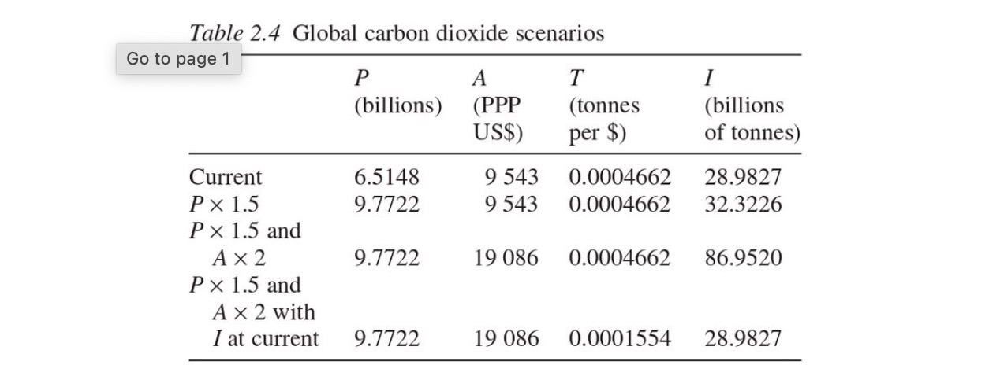
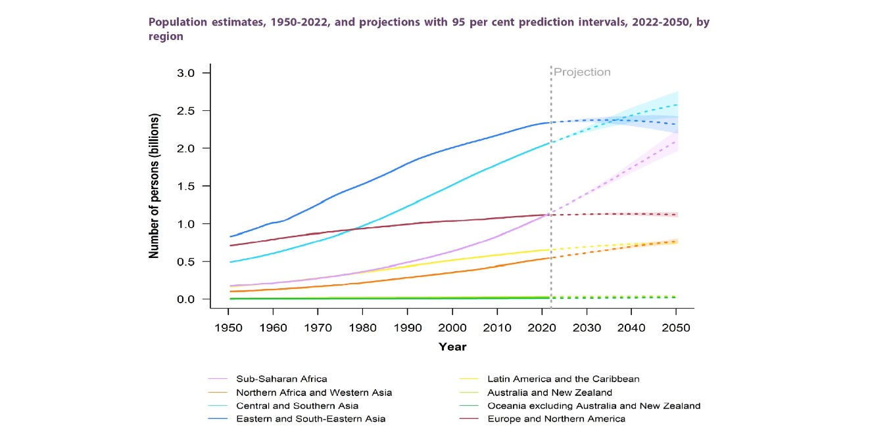
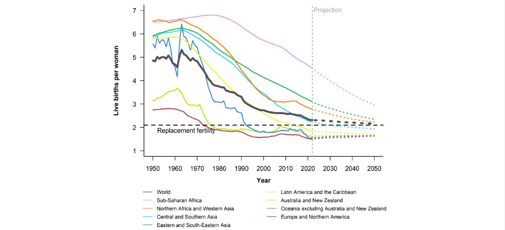
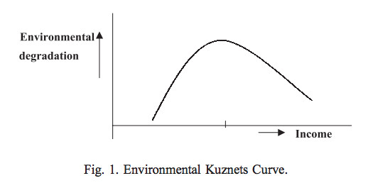
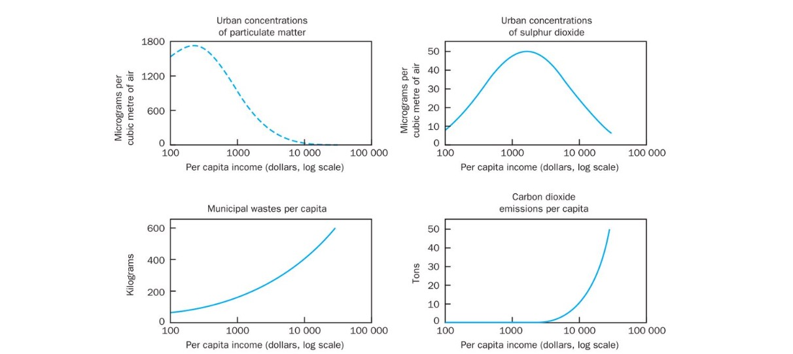
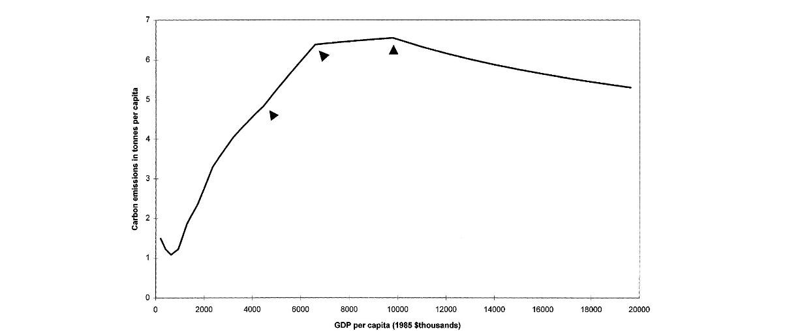

# 10.01.2023 Nachhaltigkeit 1

## Definition

> Handlungsprinzip mit Fokus auf Langfristigkeit, sodass Ressourcen sich daerhaft erhalten

- 3 Säulen: Ökologie, Ökonomie, Sozial
- Treiber der ökologischen Auswirkungen: CO2, Feinstaub, Abwässer, Abfall

## IPAT-Modell

Bestimmung des **I**mpacts, den wir auf die Umwelt haben
$$
\underset{\text{Impact}}{I} = \underset{\text{Population}}{P} \cdot \underset{\text{Affluence}}{A} \cdot \underset{\text{Technology}}{T}
$$

- Affluence = Wohlstand, gemessen pro Kopf
- Technology = Emissionen pro Produktionseinheit

Bedeutung:

- Bei steigender Weltbevölkerung und Wohlstand
- muss Technologie besser werden

### Bevölkerung

Einflüsse:

- Fertilität
    - Bildung (insb. Frauen)
    - Gesundheitssystem
- Mortalität
    - Kindersterblichkeit
    - Gesundheitssystem

Entwicklung Veölkerung

Kurzfristig: Wachstum mit geringer Rate; Langfristig: Rückgang

Entwicklung Fertilitätsraten 

### Affluence / Wohlstand

Umwelt-Kuznets-Kurve 

Annahme, dass mit steigendem Wohlstand Umweltbelastung nachlässt

- **niedriger** Entwicklungs.: Subsistenzwirtschaft
- **mittlerer** Entwicklungs.: Industrialisierung, Ressourcenabbau
- **hoher** Entwicklungs.: Umweltbewusstsein, Dienstleistungen

Empirie aus 90ern: 

- gilt eher für lokale Schadstoffe (Schwefel, Feinstaub)
- nicht für globale ($CO_2$)

neuere Erkenntnisse nach *Schmalensee et al (1998)*

- nur CO2
- Kontrolle länderspezifischer Aspekte

- langfristig sinkende CO2-Belastung p.P

