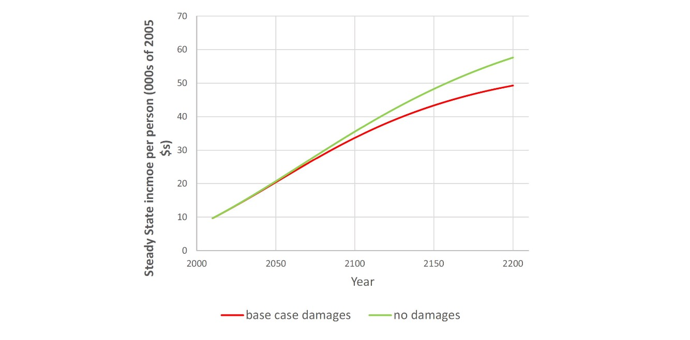
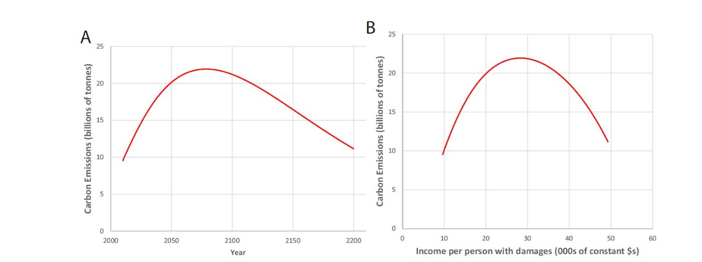
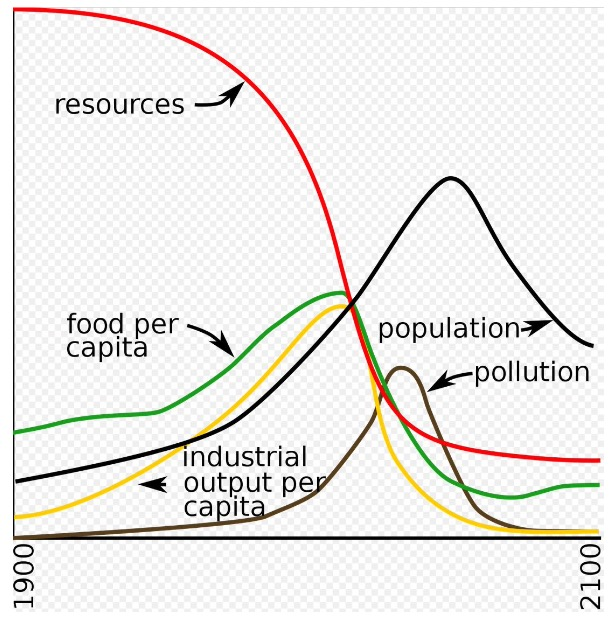

# 17.01.2023 Klima-Solow Modell

- IPAT-Modell: keine Rückwirkungen der Umweltschäden auf Wachstum

=> Klima-Modelle

- CO2 = **globale Externalität**
    - Auswirkungen unabhängig von Emissionsort
    - Schäden nicht immer an Ort der Emission

## Klima-Solow

Herausforderungen der Klimamodellierung:

- Kosten / Nutzen von Klimaschutz unterschiedlich verteilt
    - **intra-generational equity**: Asugleich zw. heute lebenden Armen / Reichen
    - **inter-generational equity**: heutige Emission = Bürde für nachkommende
- CO2 = *Tragedy of the Unmanaged Commons*
    - einzelne beste Handlungsoption $\neq$ gemeinschaftliche beste
    - Kosten einer Handlung werden auf alle verteilt
    - => Anreiz zur Übernutzung

Klimaschutz = **öffentliches Gut** (Vorteile nicht rivalisierend)

Klima-Solow = vereinfachtes Integrated-Assesment-Modell (IAM) nach `Tsigaris & Wood (2016)`

- Produktionsfunktion mit Emissionen
- Temperaturen
- Rückkopplung der Temperaturen auf Produktion

```mermaid
graph LR
W(Wachstum) --mehr--> E(Emissionen) --mehr--> T(Temperaturanstieg)
Population & Technologie & Einkommen -.-> W
T --weniger--> W
```

### Produktionsfunktion

jetzt mit Schadensfunktion:
$$
y = D_t \cdot A_t \cdot k^a_t \\
$$
mit
$$
D_t = \frac{1}{1+\theta_1  \cdot Temp_t^{\theta_2}} \le 1
$$

Wobei $Temp_t$ = Temperatur-Anomalie und $\theta_{1,2}$ = positiv

- je größer Temperaturanomalie = kleiner D 
- => kleiner y = großer Schaden

Beispiel mit 0, 1, 4 Grad und $\theta_1 = 0.002384; \theta_2 = 2$

- Temp = 0: $D = \frac{1}{1+0.002384 \cdot 0^2} = 1$
- Temp = 1: $D = \frac{1}{1+0.002384 \cdot 1^2} = 0.99 $
- Temp = 4: $D = \frac{1}{1+0.002384 \cdot 4^2} = 0.96$

### Bevölkerung und Technik

- Sparquote **s** und Abschreibung $\delta$ wie gewohnt
- Bevölkerungswachstum **n** modelliert als abnehmend (mit $\delta$) wegen langfristigkeit

$$
n_t = \frac{n_0}{(1+\delta_n)^t}
$$

- technologischer Fortschritt **g** ähnlich

$$
g_t = \frac{g_0}{(1+\delta_g)^t}
$$

### Auflösung

ausgewogener Wachstumspfad:
$$
k^* = \Big( \frac{s \cdot D_t \cdot A_t}{n_t+\delta}\Big)^{\frac{1}{(1-a)}}
$$
Wachstumsrate hängt ab von Damage-Function, abnehmende g und Wachstum von a

Beispielmodellierung:

### Emissionen

- Produktion sorgt für Emission

$$
E_t = \sigma_t \cdot Y_t
$$

abhängig von Emissionsintensität $\sigma$ (ähnlich zu Technologie aus IPAT)
$$
\sigma = \sigma_{t-1} \cdot (1+g_\sigma) \text{ mit } g_\sigma < 0
$$

- die Emissionsintensität sinkt jedes Jahr
- $g_\sigma \neq$ technischer Fortschritt!, sondern anderer Parameter

Emissionen und Jahr / Einkommen

Wachstum der Emissionen wie IPAT:
$$
g_{E,t} = n_t + g_{y} + g_{\sigma}
$$

- bis 2075: keine Senkung, da $n+g_y>g_\sigma$
    - absolut wachsende Emissionen
- Danach bessere Damage-Function und mehr Umweltschäden
    - absolut sinkende Emissionen

### Temperatur

Zusammenhang zw. Emissionen und Temperaturanstieg

- 1000 Mrd. Tonnen CO2 = 1.8° Erwärmung
- proportionale Beziehung, abhängig von Ausgangs-CO2 *C*

$$
Temp_t = \beta \cdot (C_0+\sum_1^t E_t)
$$

um auf 2° zu begrenzen, begrenze Neuemissionen möglich

## Grenzen des Wachstums

*"The Limits to Growth"*

- von Meadows, Randers Behrens
- 1972 vom Club of Rome

Simulation der natürlichen Grenzen basierend auf Ressourcen

5 Variablen:

1. Bevölkerungsentwicklung
2. Nahrungsmittelerzeugung
3. Industrieproduktion
4. Umweltverschmutzung
5. Verbrauch nicht-erneuerbarer Ressourcen

Annahmen: exponentielle von allem außer Innovation (linear)

Ergebnisse: 2 Szenarien

| Overshoot and Collapse Szenario                              | Stabilisierungszenario                    |
| ------------------------------------------------------------ | ----------------------------------------- |
|  |  |

- im ersten: nichts mehr zu essen, und dann Sterben und Zusammenbruch
- Stabiliserung: genug für alle, braucht:
    - Rückgang des Bevölkerunswachstums (teilweise eingetreten)
    - Strukturwandel zu Dienstleistungen (eingetreten)
    - Stabilisierung des Kapitalstocks (nicht eingetreten)
    - Reduzierung der Umweltverschmutzung pro Einheit (nicht eingetreten)

Diskussion: 

- Ökonomen: zu wenig technischer Fortschritt
- Unternehmen: Einschränkung der freien Wirtschaft
- Linke: Einschränkung Wachstum = Verhinderung höheres Lebenstandards

aber:

- erste Diskussion des globalen Ressourcenverbrauchs
- stark abhängig von Szenarien
- manche Vorhersagen nciht akkurat (Öl)

## Postwachstum und Degrowth

Wie weiter mit dem Wachstum? 

mehr Reichtum fördert nicht Lebenszufriedenheit (in Reichen Ländern)

Konzepte:

- Wachstumsgrenzen
- Wachstumszwänge
- alternative Wohlfahrtsmaße
- Strukturwandel

Fragen:

- wer darf noch wachsen?
- individuell oder politisch einschränken?

## Green Growth

Lösung des Konflikts zwischen Wachstum und Ökologie

- langfristiges Wachstum
- Entkopplung von Emission und Produktion
- Wachstum von energieschonenden Technologien
    - verbesserte Effizienz
- Kreislaufwirtschaft & Recycling
- Vermeidung des *Rebound-Effekts*

